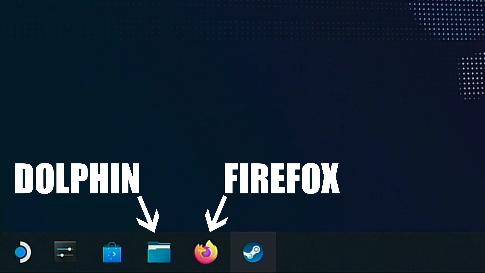
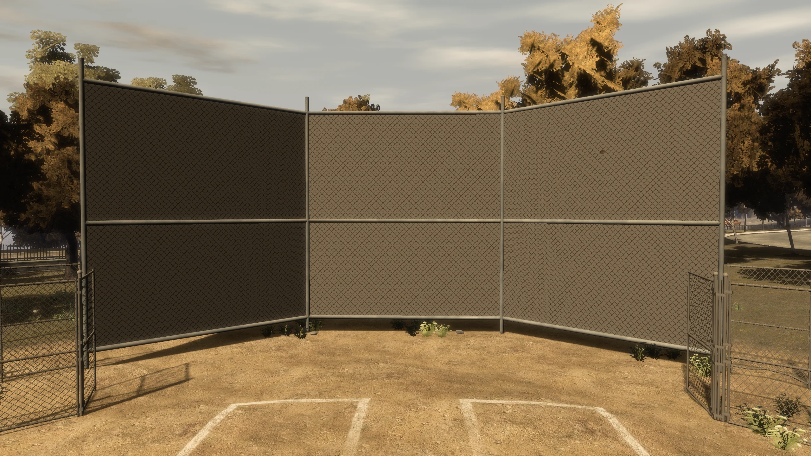
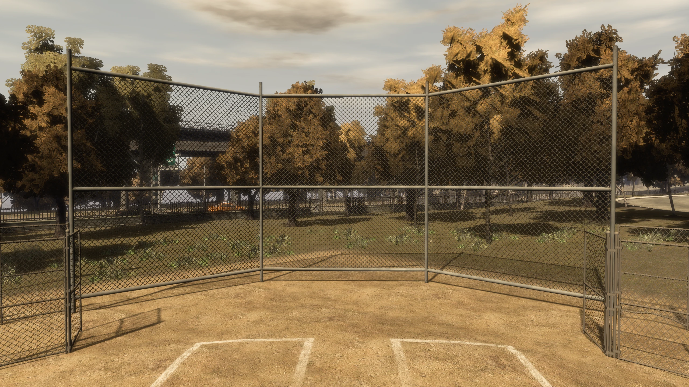
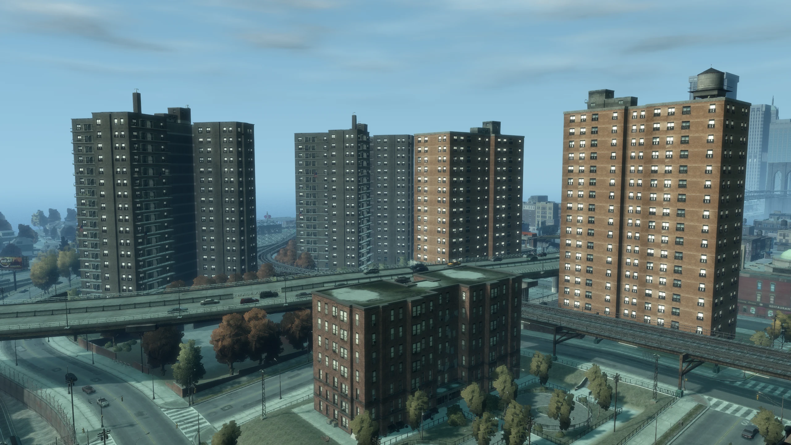
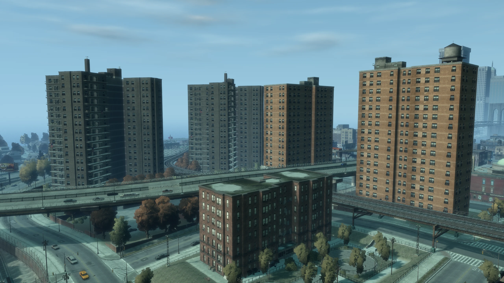
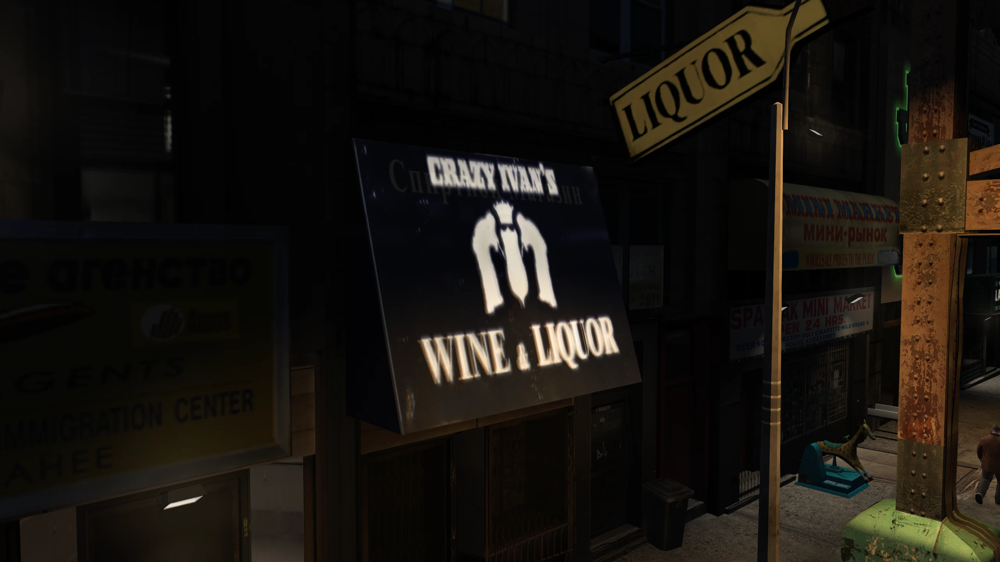
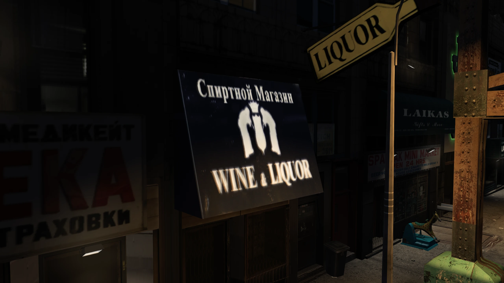
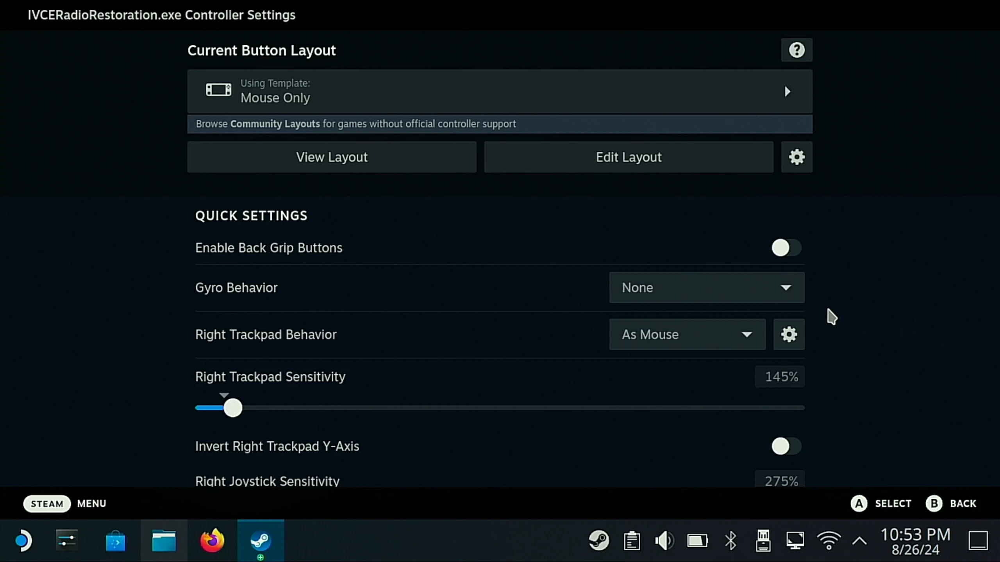

!!! warning
    This guide is only for The Complete Edition of Grand Theft Auto: IV. If you're playing on an older version, this guide won't work.

    This guide is only for Steam Deck/Linux! If you're playing on Windows, I have a seperate guide for that which you can [find here](../Fixing-GTA-IV-with-4-Mods/index.md).

## Introduction

I’ve seen a lot of people say that GTA IV is fine to play on Steam Deck out of the box because the performance is acceptable, but what I don’t think most people realize, is that there’s a lot more wrong with GTA IV’s PC version than just the performance.

There’s a lot of missing graphical effects, broken effects, poor asset changes and worst of all, the game doesn’t have Steam Deck button icons by default, disgraceful! So let’s fix this!

If you'd prefer a simpler installation instead of installing each mod indivdually, check out my [Drag n' Drop pack](../../../resources/gtaiv/TJGM's-Drag-n'-Drop-Archive/index.md){:target="_blank"} instead.

This guide is also available in video form if you find that easier to follow.

<iframe width="560" height="315" src="https://www.youtube.com/embed/T_UIMKd9wqw?si=Mixro3yXgJ-qho9S" title="YouTube video player" frameborder="0" allow="accelerometer; autoplay; clipboard-write; encrypted-media; gyroscope; picture-in-picture; web-share" referrerpolicy="strict-origin-when-cross-origin" allowfullscreen></iframe>

## Prerequisites

Everything in this guide will be done directly on the Steam Deck, you don’t have to connect your Steam Deck to a PC and you don't need any other hardware.

We also won’t be leaving any files lying around once we’re done, so if you’re worried about cluttering your system, don’t be.

To follow this guide, you’ll need to know how to access the desktop on your Steam Deck, how to control the desktop and how to locate your GTA IV folder on your Steam Deck, so let's start with that.

### Accessing the Desktop on Steam Deck

To access the desktop on your Steam Deck, hold the `Power Button` to bring up the power menu and then and select `Enter Desktop`.

### Controls on the Steam Deck Desktop

Once you’ve reached the desktop, you need to know how the controls work.

- `Right Touchpad / Right Analogue Stick` — Controls the mouse cursor.
- `Left Touchpad` — Controls scrolling (vertical and horizontal).
- `Right Trigger` — Acts as a left click. Double-click to open items.
- `Left Trigger` — Acts as a right click (opens context menus).

Useful hotkeys:

- `Steam Button + X` — Opens the on-screen keyboard when a text box is selected.

### Finding Game Files on the Steam Deck

Before we begin, we need to find our game files and also create a link to it on our desktop. This is also a good time to learn the desktop controls.

1. Launch the Steam application while on your desktop, locate `Grand Theft Auto IV: The Complete Edition` in your Steam Library, press the `Left Trigger` on the game to open the context menu, go to `Manage` and then click `Browse Local Files`.
2. Once the game folder appears, go to the address bar at the top, press `Right Trigger` at the end of it, then hold `Right Trigger` and move the mouse across the address bar using the `Right Touchpad / Right Analogue Stick` to highlight the folder location. Once highlighted, press `Left Trigger` to open the context menu and then click `Copy`.

    If you're not sure how to do this, check this little video below.

    <video width="2560" autoplay muted loop>
      <source src="assets/highlighting.mp4" type="video/mp4">
    </video>

3. Once you've copied the address bar, open the `GTAIV` folder and then minimize the folder by pressing the down arrow in the top right, we'll go back to this folder later.
4. Press `Left Trigger` on the desktop to open the context menu, go to `Create New` and then click `Link to File or Directory…`
5. In this new window, go to the second box for `File or directory to link to:`, press `Left Trigger` and then click `Paste` to paste the address we copied.
6. In the `Name for new link` box, remove all text (Press `Right Trigger` on the box and then use `Steam Button + X` to open the keyboard) and then type “Grand Theft Auto IV”. Once done, press `OK`.

You should now have a link to your GTA IV folder on your desktop, which should be named `Grand Theft Auto IV`, we’ll need this later.

### Using the browser (Firefox) and File Explorer (Dolphin)

To view webpages and download mods, you should use Firefox, the default browser on the Steam Deck desktop, you can find it pinned on the taskbar at the bottom. I'd recommend using Firefox to open this guide on your Steam Deck so you can quickly access the download links to the mods in this guide.

To view and install the mods, you should use Dolphin, the default file explorer on the Steam Deck desktop.

Both can be found on the taskbar at the bottom of your screen.

## Fusion Fix

So the first mod we'll install is Fusion Fix.

If you don't know, Fusion Fix is basically *the* mod which fixes most of GTA IV's issues. The game is broken in so many ways on PC compared to the console versions that it's actually hard to believe.

Fusion Fix adds many new faithful graphical effects, a TON of quality-of-life features which brings the game up to a more modern standard, fixes hundreds of bugs including high-FPS bugs, adds many new options and overall just massively improves the experience.

### Highlights

I won't cover all of things Fusion Fix does in this guide, but I will go over some of the highlights of the mod so you'll know what you're in for.

If you want to view everything Fusion Fix does, check out my [Fusion Fix Wiki](../../../resources/gtaiv/Fusion-Fix-Wiki/index.md){target="_blank"} which covers all of the mods features and changes.

If you just want to skip the highlights and go straight to installing the mod, you can [click here](#download-installation), otherwise keep scrolling.

#### Rain

Rain on PC was made almost invisible, rain streaks became shorter at higher frame rates and rain droplets on screen became pitch black and lost their refraction effect from console.

Fusion Fix makes rain much more visible, fixes rain streaks so they stay the same size regardless of frame rate and it makes rain droplets coloured again, as well as restoring the refraction effect.

  
  

  
  

  
  

#### Reflections

Reflections were toned down significantly on PC, vehicle reflections became jagged due to a bug and mirror reflections became distorted at certain camera angles.

Fusion Fix restores the stronger console reflections, fixes the bug which made vehicle reflections jagged, and it fixes mirrors so they no longer become distorted at certain camera angles.

  
  

  
  

#### Shadows

Shadows were by far one of the most broken aspects of the game.

After patch 1.0.6.0, they had horrible filtering, suffered from peter panning, had their draw distance reduced, performed significantly worse than the original shadows implementation and had many other issues.

Fusion Fix completely replaces the filtering and bias code, adds support for animated tree shadows, adds contact hardening shadows, fixes dozens bugs related to shadows in general and it also enables shadows on many objects that were missing them before.

  
  

  
  

  
  
  

  
  

  
  

  
  

#### Z-Fighting

Z-fighting was a major problem on the PC version of GTA IV, with constant flickering all around the map as soon as you gained any height.

The PlayStation 3 version partially dealt with it by using a very high near clip value, while the Xbox 360 solved it by using a reversed floating point depth buffer. Fusion Fix provides a solution that yields results similar to the better approach from the Xbox 360, and effectively eliminates all z-fighting.

<video width="100%" autoplay loop>
  <source src="../../../../assets/shared/fusionfix/fixes/Z-Fighting.mp4" type="video/mp4">
</video>

#### Depth-of-Field

Depth-of-field in the vanilla game is tied to the Definition option. It also doesn't scale with resolution, this results in the effect becoming weaker at resolutions higher than 720p.

Fusion Fix seperates depth-of-field from Definition, giving it its own option and allowing users to select its strenght or disable it completely.

The effect has also been rewritten so it looks better with bokeh blur and it now scales correctly up to 4K.

  
  

#### Anti-Aliasing

The Xbox 360 version of GTA IV ran at 1280x720 with 2x MSAA. Meanwhile the PC version lacked any anti-aliasing whatsoever.

Fusion Fix adds an anti-aliasing option that allows users to select either FXAA or SMAA, two simple and performance friendly AA solutions which do an excellent job at smoothing out jagged edges, especially at high resolutions.

  
  
  

#### Volumetric Fog

The original game fog moves with the camera position and when the player is up high, you can see the water cut off at the horizon.

Fusion Fix adds a new volumetric fog option which enables volumetric fog. This fog no longer moves with the camera position, it increases the farclip (draw distance) to 4500 meters, the fog itself blends in with the bottom sky colour seamlessly and the horizon cutting off is no longer visible.

  
  

  
  

#### Sun Shafts

The original game's sun is pretty effectless when compared to every other GTA title.

Fusion Fix adds a new sun shafts option which adds god rays coming from the sun.

  
  

#### Improved Loading Times

GTA IV on PC has an unskippable intro and it takes you to a main menu first instead of just loading your last save immediately like console. Loading times are also longer than necessary even with extremely fast SSDs.

Fusion Fix adds a skip intro and skip menu option in the GAME menu, as well as improving overall load times. This significantly reduces how long it takes to get in-game.

<video width="100%" controls muted>
  <source src="../../../../assets/shared/fusionfix/fixes/LoadTimes.mp4" type="video/mp4">
</video>

#### Seasonal Events

Fusion Fix adds seasonal events to the game which includes snow at winter and a scarier atmosphere at Halloween. The snow effect is done almost entirely using shaders instead of replacing map textures, similar to GTA Online's yearly snow event.

The winter event starts on the 30th of December and ends on the 3rd of January.

The Halloweeen event starts on the 31st of October and ends on the 1st of November.

There's a seasonal event option to enable and disable these events. You can also manually activate them at any time with cheats.

#### Fusion Overloader

Fusion Fix adds a type of Modloader called Fusion OverLoader, you don’t really need to know too much about it for this guide. But if you do plan on installing more mods in the future, I’d recommend checking out my [Fusion Overloader tutorial](../Fusion-Overloader-Tutorial/index.md){target="_blank"} once you're done with this guide.

We'll be installing all our mods through Fusion Overloader in this guide, so you'll see how easy it is soon.

#### Even more...

If you want to know what else Fusion Fix fixes or adds to the game, you can either check out my [Fusion Fix Wiki](../../../resources/gtaiv/Fusion-Fix-Wiki/index.md){target="_blank"} or you can watch my video covering nearly the entirety of the mod.

<iframe width="560" height="315" src="https://www.youtube.com/embed/XTuOortPoY4?si=_mi7HnZJ6rsnRFnS" title="YouTube video player" frameborder="0" allow="accelerometer; autoplay; clipboard-write; encrypted-media; gyroscope; picture-in-picture; web-share" referrerpolicy="strict-origin-when-cross-origin" allowfullscreen></iframe>

### Download & Installation

1. Download the latest Fusion Fix .zip from the [official GitHub release page](https://github.com/ThirteenAG/GTAIV.EFLC.FusionFix/releases){target="_blank" rel="noopener"} (found under `Assets`). Do not download the legacy addon or installers, they're not needed.
2. Open the archive you just downloaded, open the `GTAIV` folder you minimized earlier and then copy and paste everything from the archive into your game folder where `GTAIV.exe` is located.

## Console Visuals

Our next mod to install is Console Visuals.

The PC version of GTA IV changed quite a few of the games assets, so they're different than console. Things like certain clothing options, animations and other things were different between the two versions.

The mod Console Visuals aims to restore all of that content from console. Most of the changes are completely subjective, they’re just small things such as...

The way Niko might hold a specific weapon...

  
  

Or the size of the games help boxes...

  
  

But Console Visuals does come with one change which is definitely an improvement over the PC version, and that’s the vegetation.

On PC, a lot of the vegetation was changed, this includes a new grass model, which is actually worse because it's offset too low which causes the bottom half of the grass to be pushed under the ground.

Just look at this comparison here, the grass on PC is mostly under the ground compared to the console grass.

  
  

As well as restoring the console grass, it also restores the console trees. However, the trees in Console Visuals have higher resolution textures compared to console, because as it turns out, Rockstar reused these tree textures in Max Payne 3 at a higher resolution.

The team behind Console Visuals managed to extract those textures and got them into GTA IV with some corrections made to them.

  
  

  
  

  
  

### Download & Installation

For this guide we'll just install the vegetation improvements from Console Visuals, as it's the one thing that I'd argue isn't really subjective compared to the other changes between console and PC.

If you want to install the other console assets from Console Visuals, have a look at my [Console Visuals Wiki](../../../resources/gtaiv/Console-Visuals-Wiki/index.md){target="_blank"}, this will show you all of the different Console Visual assets and how to install them.

But like I said, console vegetation is arguably better in every aspect, so we'll just install that for this guide.

1. Download the latest `Console.Vegetation.zip` from the [official Console Visuals GitHub release page](https://github.com/Tomasak/Console-Visuals/releases){target="_blank" rel="noopener"} (found under `Assets`).
2. Open the archive you just downloaded and then copy and paste the `update` folder from the archive, into your `GTAIV` folder, where `GTAIV.exe` is located.

And that’s it, the vegetation from Console Visuals is installed!

## Various Fixes

The penultimate mod we’re going to install is Various Fixes. This mod fixes a huge number of texture issues, prop placement issues and other problems and inconsistencies throughout GTA IV's assets.

It’s hard to even cover everything this mod fixes as the [list of fixes](https://gtaforums.com/topic/975211-various-fixes/){target="_blank" rel="noopener"} is VERY big. However, I'll give you three quick examples so you can get an idea of what this mod is about.

  
  

  
  

  
  

### Download and Installation

Okay let's download and install Various Fixes.

1. Download the latest `Installation.through.Fusion.Overloader.zip` from the [official Various Fixes GitHub release page](https://github.com/valentyn-l/GTAIV.EFLC.Various.Fixes/releases){target="_blank" rel="noopener"} (found under `Assets`).
2. Open the archive you just downloaded, open the `Installation through Fusion Overloader` folder in the archive and then copy and paste the `update` folder from that folder, into your `GTAIV` folder, where `GTAIV.exe` is located.

## Radio Restoration

Like all of the other old GTA titles, GTA IV has had music removed due to licenses expiring.

The radio station Vladivostok, lost all of its original songs except one when licensing expired in 2018, so Rockstar added a whole new soundtrack to the station instead, other radio stations also lost some songs too.

The best mod to restore cut music from the Complete Edition of GTA IV, is the Radio Restoration mod, so we're going to use that in this guide.

### Download and Installation

1. Download the latest `Radio.Restoration.Mod.zip` from the [official Radio Restoration GitHub release page](https://github.com/Tomasak/GTA-Downgraders/releases){target="_blank" rel="noopener"} (found under `Assets`).
2. Open the archive you just downloaded and copy the `IVCERadioRestoration.exe` and `Resources` folder from the archive to your desktop.
3. Launch the Steam application while on your desktop, click `Add a game` on the bottom left, click `Add a Non-Steam game...`, click `Browse...`, click `Desktop` and then select `IVCERadioRestoration.exe`, click `Open` and then click `Add Selected Programs`.
4. Locate `IVCERadioRestoration.exe` in your Steam library, select it, then on the right side (opposite side of the `PLAY` button), select the `🎮` controller icon and then in the controller settings page, make sure the `Current Button Layout` uses the template `Mouse Only`. Once it's set, you can close this page.

    It should look like this...

    

4. Go back to your Steam Library, press the `Left Trigger` on `IVCERadioRestoration.exe` to open the context menu, click on `Properties...`, click on `Compatibility` and then make sure the box is ticked next to `Force the use of a specific Steam Play compatibility tool`.
5. Once again go back to your Steam Library, locate `IVCERadioRestoration.exe` and press the `PLAY` button to launch the application. Click `Next >` to begin the installation and then click `Next` on the next page. On the `Choose Components` screen, you can customise the mod to your liking, clicking on a component will give you a description on the right-hand side. You already have Fusion Fix installed, so you don't need to select that. Once you've selected what you want, click `Next >`.
6. On the `Choose Install Location` page, click `Browse...`, click the `+` icon next to the `/` drive to expand it, then expand the `home` folder, then the `deck` folder, then the `Desktop` folder, then the `Grand Theft Auto IV` folder, then click on the `GTAIV` folder (don't expand it, select the folder itself), click `OK`, click `Install` and then click `Finish` once the installer is finished.

You've now restored the music cut from GTA IV!

## Clean Up

Once you're done, you might want to clean up anything you've downloaded or created throughout this guide. It's not necessary, but many people don't like cluttering their Steam Deck with unnecessary files.

1. Go back to your Steam Library, press the `Left Trigger` on `IVCERadioRestoration.exe` to open the context menu, go to `Manage` and then click on `Remove non-Steam game from your library`.
2. Go back to your desktop, press the `Left Trigger` on the `Grand Theft Auto IV` folder to open the context menu and then click on `Move to Trash`.
3. Go back to Firefox, click the menu button on the top right (the one that's 3 vertical lines stacked on top of each other), click on `Downloads` and then click `Clear Downloads`.
4. Go back to Dolphin (the file explorer on this version of Linux), click the `Downloads` folder, press `Right Trigger` in an empty space within the downloads folder and move the mouse across all of the items in the folder by using the `Right Touchpad / Right Analogue Stick`. Once everything in the folder is highlighted, press `Left Trigger` on any of the highlighted items to open the context menu and then click on `Move to Trash`. Open the `Trash` folder on the left hand side menu, click `Empty Trash` and then click on `Empty Trash` again.

You've now cleaned up everything you downloaded.

## Outro and Additional Links

And that's it, you now have the BEST version of GTA IV right on your Steam Deck!

If you'd like to learn more about Fusion Overloader, the modloader that comes with Fusion Fix, make sure to check out my [Fusion Overloader Tutorial](../Fusion-Overloader-Tutorial/index.md){target="_blank"}.