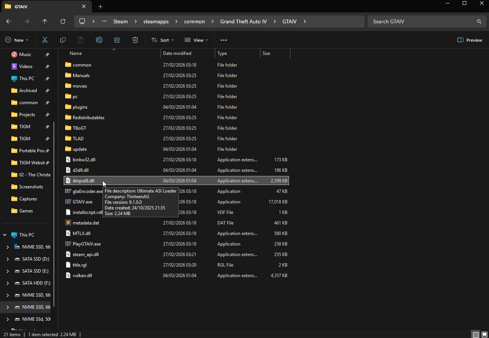

## Introduction

If you’re not aware, GTA IV has a way to load game files without actually replacing the game's original files.

If you create a folder called **“update”** in your GTA IV folder and add an .IMG archive called **“update.img”**, any modified files you put into this .IMG archive will be used over the games original files, assuming the files you’re modifying were in an .IMG archive to begin with.

So if a mod says to replace a file in an .IMG archive such as...

`GTAIV\pc\models\cdimages\vehicle.img`

You could instead just take the mod file and place it inside the update folder archive...

`GTAIV\update\update.img`

The file inside `update.img` will be used over the file in `vehicle.img`. This means you've installed a modified file without actually replacing the original game file.

## Fusion Overloader

The modding community took advantage of this **"update"** folder and the result was Fusion Overloader, a type of Modloader for GTA IV that makes use of the **“update”** folder so that it can load additional .IMG archives other than **"update.img"** AS WELL as all of the other game files outside of .IMG archives.

This allows you to install mods with a simple drag and drop, without replacing game files, without needing additional tools and without needing to make backups of your game files.

## Installing Fusion Overloader

Fusion Overloader isn't really its own mod, rather it's a component of Ultimate ASI Loader, a mod which works on hundreds of games and allows modders to load their ASI plugins for any game that supports it.

While you can install Ultimate ASI Loader on its own for GTA IV, the mod actually comes packaged with Fusion Fix already, a mod you *should* be using if you're playing GTA IV on PC. If you haven't got Fusion Fix installed, I'd recommend
following my [Fixing GTA IV with 4 Mods](../Fixing-GTA-IV-with-4-Mods/index.md) guide to install it and some other vital mods.

For GTA IV, Ultimate ASI Loader is called **"dinput8.dll"**. For other games, it might be named differently.

Once this file is in the game folder, Fusion Overloader is active and you're ready to use the **"update"** folder to load your mods.

## Installing Mods via Fusion Overloader

Depending on the type of mod files you need to install, installation will be different. While mods built with Fusion Overloader in mind can just be installed with a simple drag and drop, many older mods provide outdated instructions and don't make use of Fusion Overloader by default.

We can do it ourselves, but files from .IMG archives have to be installed one way with Fusion Overloader and files outside of .IMG archives have to be installed another way with Fusion Overloader. So we'll cover how both are done in this guide.

!!! warning
    Please keep in mind Fusion Overloader only works for modding original game files. Additional plugins such as ASI plugins, .dll mods and so on have to be installed normally. These type of mods don't usually replace game files, so it's not a problem anyway.

### Installing Mods made for Fusion Overloader

If you download a mod and it contains an **"update"** folder, simply copy the **"update"** folder to your game folder where **"GTA IV.exe"** is located and it'll merge with your own **"update"** folder.

That's it, a mod made for Fusion Overloader is now installed.

If the mod contains .IMG archives, you might want to make use of features such as [Priorities](#priorities) and [Episode Specific Loading](#episode-specific-loading). These are covered later.

### Installing .IMG Mods with Fusion Overloader

If you download a mod and it says you need to open one of the games .IMG archives to replace a file, this is how you'd install it in Fusion Overloader instead. You will need [OpenIV](https://openiv.com/) for this.

1. Open the "update" folder and create a new folder. Name the new folder after the mod you're installing, e.g. if you're installing a mod called HQ Vehicles, name the folder **"HQ Vehicles"**.
2. Launch OpenIV, enable "Edit mode" in the top right, go to the **"HQ Vehicles"** folder you created in the **"update"** folder, right click anywhere in the folder and create a new .IMG archive, name the archive after the mod.
3. Using OpenIV, open the archive and place the files from the mod into the .IMG archive you just created.

That's it, the mod files inside `GTAIV\update\HQ Vehicles\HQ Vehicles.img` will now be used over the original game files.

#### Priorities

If you have two .IMG mods which replace the same files, you can choose which one you want to be used over the other using the priority system.

Fusion Overloader will load .IMG archives based on the alphabetical order of the folders they're in, so you should use numbers at the start of the folder names to prioritize mods.

For example...

You have two mods which have modded files that change the Infernus, the mods are called **"HQ Vehicles"** and **"TJGMs Enhanced Infernus"**.

Both mods have .IMG archives which contain the Infernus files **"infernus.wft"** (model) and **"infernus.wtd"** (texture).

You want to keep **"HQ Vehicles"** because you like the other vehicle mods it contains, but you would like to use the Infernus files from "TJGMs Enhanced Infernus" instead.

If we don't add a number at the beginning of the folder names and just leave them like this...

`GTAIV\update\HQ Vehicles\HQ Vehicles.img`

`GTAIV\update\TJGMs Enhanced Infernus\TJGMs Enhanced Infernus.img`

Then the Infernus files within **"HQ Vehicles.img"** will be used instead of the Infernus files within **"TJGMs Enhanced Infernus"**. Because the folder **"HQ Vehicles"** is first alphabetically.

But if you use numbers, you can prioritize the folders like this...

`GTAIV\update\2. HQ Vehicles\HQ Vehicles.img`

`GTAIV\update\1. TJGMs Enhanced Infernus\TJGMs Enhanced Infernus.img`

Because the folders are now numbered, "**1. TJGMs Enhanced Infernus** is now prioritized over **2. HQ Vehicles** as it comes first alphabetically.

#### Episode Specific Loading

If you only want an .IMG archive to load depending on whether you're playing the base game or one of the episodes, you can do that with Fusion Overloader too.

For example...

If you only want **"HQ Vehicles"** to be enabled when playing the main GTA IV game, you can place the .IMG archive into a folder called **"IV"** and it'll only load when playing the base game.

`GTAIV\update\HQ Vehicles\IV\HQ Vehicles.img`

If you only want it enabled during The Ballad of Gay Tony...

`GTAIV\update\HQ Vehicles\TBOGT\HQ Vehicles.img`

And if you only want it enabled during The Lost and Damned...

`GTAIV\update\HQ Vehicles\TLAD\HQ Vehicles.img`

### Installing non-IMG Mods with Fusion Overloader

If you download a mod and it says you need to replace a game file that's NOT in an .IMG archive, it's done a bit differently. Game files not within .IMG archives need to their location mirrored in the update folder.

Here's two examples...

1. You download a mod which changes **"timecyc.dat"**. The mod instructions tells you to replace the original file located at `GTAIV\pc\data\timecyc.dat`.

    To install the modded file using Fusion Overloader, just mirror the location in the update folder like so `GTAIV\update\pc\data\timecyc.dat`.

    The modded **timecyc.dat** mirrored in the **"update"** folder will now be used instead of the original **timecyc.dat**.

2. You download a mod which changes **"WeaponInfo.xml"**. The mod instructions tells you to replace the original file located at `GTAIV\common\data\WeaponInfo.xml`.

    To install the modded file using Fusion Overloader, just mirror the location in the update folder like so `GTAIV\common\data\WeaponInfo.xml`.

    The modded **WeaponInfo.xml** mirrored in the **"update"** folder will now be used instead of the original **WeaponInfo.xml**.

---

  <h3>Found this guide useful?</h3>
  
Gain benefits such as shout-outs at the end of videos, early access to TJGM videos, early access to TJGM mods, VIP Discord access and much more by supporting me and my work on Patreon, it's very much appreciated! ❤️

  <a
    class="md-button"
    href="https://patreon.com/tjgm"
    target="_blank"
    rel="noopener"
    style="background:#F96854; color:white; border:none; border-radius:8px; padding:.6em 1.2em; margin-top:0.5rem;"
  >
    ⭐ Support on Patreon
  </a>

