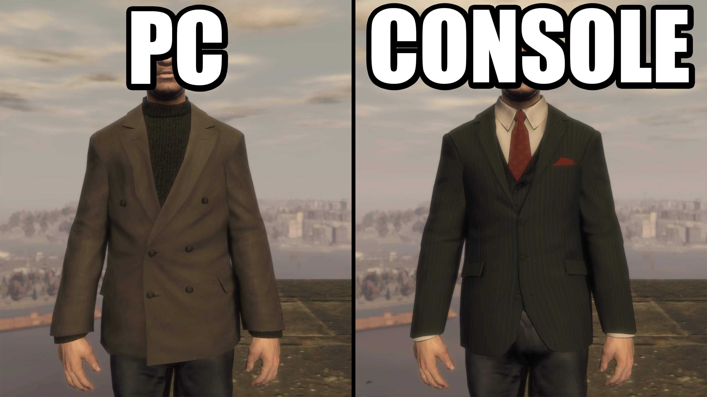
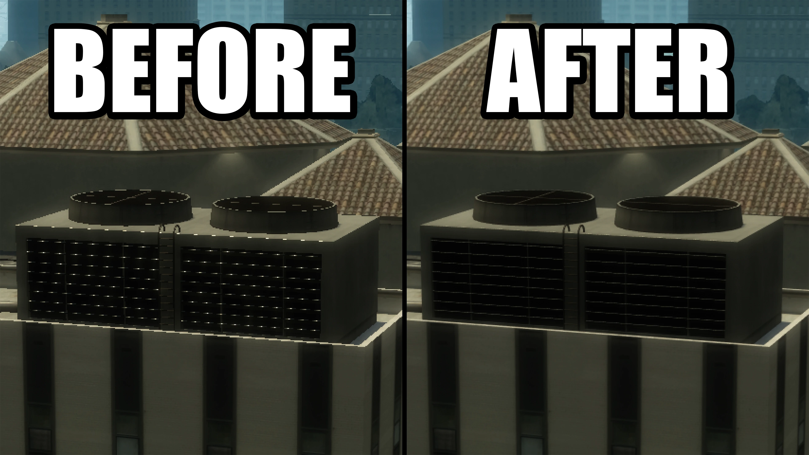
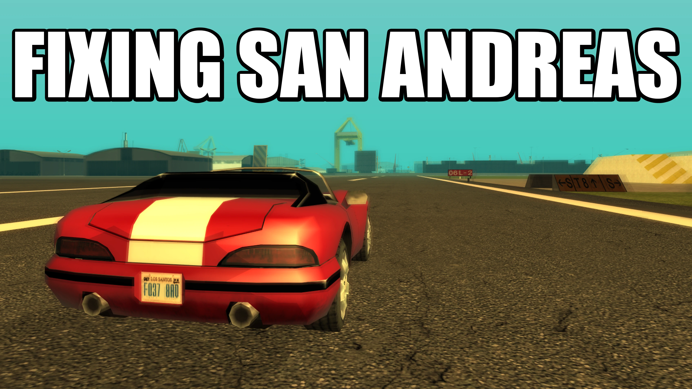
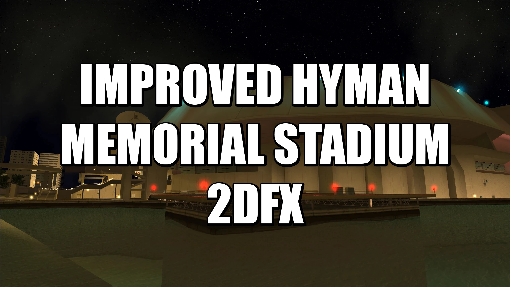
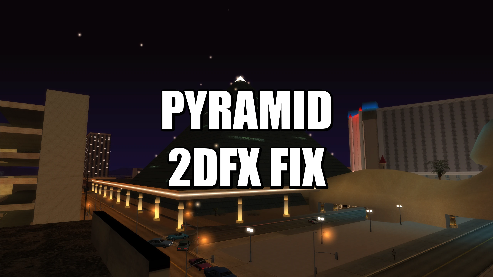
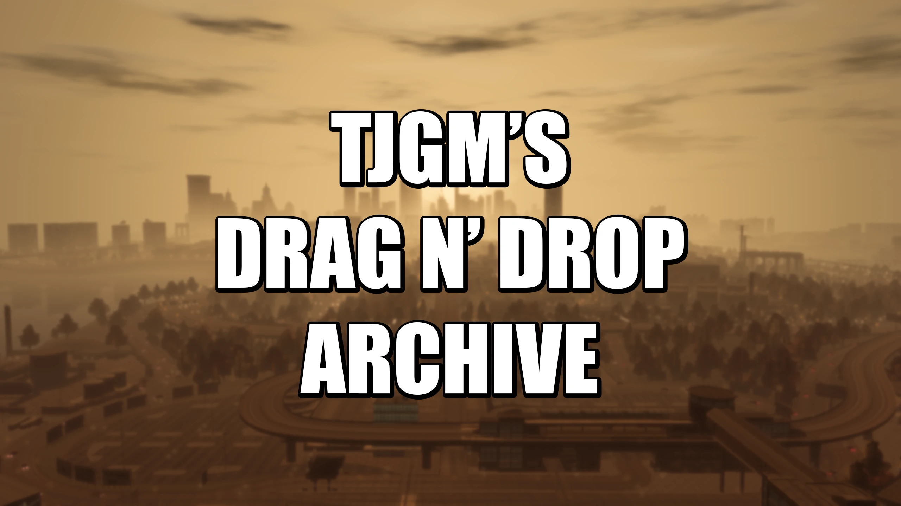

<!-- =========================
     HERO SECTION
     ========================= -->

  <!-- Preload light hero image -->
  

  <!-- Hero fade overlay -->
  

  <!-- Hero content -->
  

    <h1>Welcome to the TJGM website!</h1>

    <!-- Subheading -->
    
The best place for technical GTA guides, news, videos and more.

    

      <!-- Twitch Stream -->
      

        <iframe
          src="https://player.twitch.tv/?channel=tjgm&parent=tjgm.dev&muted=true&autoplay=true"
          title="TJGM on Twitch"
          allowfullscreen>
        </iframe>
      

      <!-- Buttons -->
      

        <a href="#news" class="md-button hero-btn hero-btn-dark">
          📰 News
        </a>

        <a href="#latest-videos" class="md-button hero-btn hero-btn-dark">
          🎥 Videos
        </a>

        <a href="#mods" class="md-button hero-btn hero-btn-dark">
          🔧 Mods
        </a>

        <a href="#guides" class="md-button hero-btn hero-btn-dark">
          📚 Guides
        </a>

        <a href="https://www.patreon.com/TJGM" class="md-button hero-btn hero-btn-accent" target="_blank" rel="noopener">
          ⭐ Patreon
        </a>

      

    

  

<!-- Push content below hero -->

<!-- =========================
     NEWS SECTION
     ========================= -->

  <h2>News</h2>

  <!-- News Post 1 -->
  

    <a href="news/a-new-modding-site-for-gta-games-is-now-live/" target="_blank"> <!-- Link to post goes here, quickest way is to copy and paste from URL on local site -->
      

         <!-- Thumbnail for post goes here. Copy relative path for file -->
      

      
A New Modding Site For GTA Games Is Now Live!
 <!-- Title of post goes here -->
    </a>
    

      October 7, 2026 <!-- Date of post goes here -->
    

  

  <!-- News Post 2 -->
  

    <a href="news/new-silentpatch-builds-released-for-gta-iii-vice-city-and-san-andreas/" target="_blank"> <!-- Link to post goes here, quickest way is to copy and paste from URL on local site -->
      

         <!-- Thumbnail for post goes here. Copy relative path for file -->
      

      
New SilentPatch Builds Released for GTA III, Vice City and San Andreas
 <!-- Title of post goes here -->
    </a>
    

      July 31, 2026 <!-- Date of post goes here -->
    

  

  <!-- News Post 3 -->
  

    <a href="news/fusion-fix-5-for-gta-iv-is-now-available/" target="_blank"> <!-- Link to post goes here, quickest way is to copy and paste from URL on local site -->
      

         <!-- Thumbnail for post goes here. Copy relative path for file -->
      

      
Fusion Fix 5 For GTA IV Is Now Available
 <!-- Title of post goes here -->
    </a>
    

      May 2, 2026 <!-- Date of post goes here -->
    

  

  <!-- View More -->
  

    <a href="news/" target="_blank"> <!-- Link to news index -->
      

         <!-- Thumbnail for post goes here. Copy relative path for file -->
      

      
View more...
 <!-- Title of post goes here -->
    </a>
  

<!-- =========================
     LATEST VIDEOS SECTION
     ========================= -->

  <h2>Videos</h2>

  

    <a href="https://www.youtube.com/watch?v=pYV--ytTWZk" target="_blank" rel="noopener"> <!-- Link to video goes here -->
      

         <!-- Thumbnails should always be here, files should be replaced/renamed to update. Don't forget alt text -->
      

      
GTA IV's Weird PC Assets
 <!-- Title of video goes here, make sure to update alt above -->
    </a>
  

  

    <a href="https://www.youtube.com/watch?v=-QKUGB8NjKA" target="_blank" rel="noopener"> <!-- Link to video goes here -->
      

         <!-- Thumbnails should always be here, files should be replaced/renamed to update. Don't forget alt text -->
      

      
GTA IV Now Supports DLSS
 <!-- Title of video goes here, make sure to update alt above -->
    </a>
  

  

    <a href="https://www.youtube.com/watch?v=C3ibU5WY7RM" target="_blank" rel="noopener"> <!-- Link to video goes here -->
      

         <!-- Thumbnails should always be here, files should be replaced/renamed to update. Don't forget alt text -->
      

      
Modders Are Still Fixing San Andreas in 2026
 <!-- Title of video goes here, make sure to update alt above -->
    </a>
  

  

    <a href="https://www.youtube.com/@tjgm" target="_blank" rel="noopener"> <!-- Link to channel -->
      

         <!-- Thumbnails should always be here, files should be replaced/renamed to update. Don't forget alt text -->
      

      
View more...
 <!-- Title of video goes here, make sure to update alt above -->
    </a>
  

<!-- =========================
     MODS SECTION

     Available game tags (colours can be changed in home.css)
    
Patreon

    
III

    
VC

    
SA

    
LCS

    
VCS

    
CTW

    
IV

    
V

    
VI

     ========================= -->

  <h2>Mods</h2>

  <!-- Improved 2DFX -->
  

    <a href="mods/Improved-2DFX/" target="_blank"> <!-- Link to mod folder goes here -->
      

         <!-- Mod thumbnail goes here -->
      

      
Improved 2DFX
 <!-- Mod title goes here -->
    </a>
    
 <!-- Game badges go below here. See section comment for options -->
      
Early Access

      
III

      
VC

      
SA

    

  

  <!-- Improved Hyman Memorial Stadium 2DFX -->
  

    <a href="mods/Improved-Hyman-Memorial-Stadium-2DFX/" target="_blank"> <!-- Link to mod folder goes here -->
      

         <!-- Mod thumbnail goes here -->
      

      
Improved Hyman Memorial Stadium 2DFX
 <!-- Mod title goes here -->
    </a>
    
 <!-- Game badges go below here. See section comment for options -->
      
VC

    

  

  <!-- Jizzy's Pleasure Dome Remastered 2DFX -->
  

    <a href="mods/Jizzy's-Pleasure-Dome-Remastered-2DFX/" target="_blank"> <!-- Link to mod folder goes here -->
      

         <!-- Mod thumbnail goes here -->
      

      
Jizzy's Pleasure Dome Remastered 2DFX
 <!-- Mod title goes here -->
    </a>
    
 <!-- Game badges go below here. See section comment for options -->
      
SA

    

  

  <!-- No Extra Air Resistance -->
  

    <a href="mods/No-Extra-Air-Resistance/" target="_blank"> <!-- Link to mod folder goes here -->
      

         <!-- Mod thumbnail goes here -->
      

      
No Extra Air Resistance
 <!-- Mod title goes here -->
    </a>
    
 <!-- Game badges go below here. See section comment for options -->
      
SA

    

  

  <!-- Orange Bulb Lampposts -->
  

    <a href="mods/Orange-Bulb-Lampposts/" target="_blank"> <!-- Link to mod folder goes here -->
      

         <!-- Mod thumbnail goes here -->
      

      
Orange Bulb Lampposts
 <!-- Mod title goes here -->
    </a>
    
 <!-- Game badges go below here. See section comment for options -->
      
SA

    

  

  <!-- Pyramid 2DFX Fix -->
  

    <a href="mods/Pyramid-2DFX-Fix/" target="_blank"> <!-- Link to mod folder goes here -->
      

         <!-- Mod thumbnail goes here -->
      

      
Pyramid 2DFX Fix
 <!-- Mod title goes here -->
    </a>
    
 <!-- Game badges go below here. See section comment for options -->
      
SA

    

  

  <!-- Weapon Coronas -->
  

    <a href="mods/Weapon-Coronas/" target="_blank"> <!-- Link to mod folder goes here -->
      

         <!-- Mod thumbnail goes here -->
      

      
Weapon Coronas
 <!-- Mod title goes here -->
    </a>
    
 <!-- Game badges go below here. See section comment for options -->
      
SA

    

  

  <!-- TJGM's Drag n' Drop Archive -->
  

    <a href="resources/gtaiv/TJGM's-Drag-n'-Drop-Archive" target="_blank"> <!-- Link to mod folder goes here -->
      

         <!-- Mod thumbnail goes here -->
      

      
TJGM's Drag n' Drop Archive
 <!-- Mod title goes here -->
    </a>
    
 <!-- Game badges go below here. See section comment for options -->
      
Modpack

      
IV

    

  

<!-- =========================
     GUIDES & RESOURCES SECTION
     ========================= -->

  <h2>Guides</h2>

  <h2>Guides</h2>

- [Fixing GTA IV with 4 Mods](guides/gtaiv/Fixing-GTA-IV-with-4-Mods/index.md){target="_blank"}
- [Fixing GTA IV with 4 Mods on Steam Deck](guides/gtaiv/Fixing-GTA-IV-with-4-Mods-on-Steam-Deck/index.md){target="_blank"}
- [Fusion Overloader Tutorial](guides/gtaiv/Fusion-Overloader-Tutorial/index.md){target="_blank"}
- [Removing Rockstar Games Launcher from GTA IV](guides/gtaiv/Removing-Rockstar-Games-Launcher-from-GTA-IV/index.md){target="_blank"}

  <h2>Resources</h2>

- [Console Visuals Wiki](resources/gtaiv/Console-Visuals-Wiki/index.md){target="_blank"}
- [Fusion Fix Wiki](resources/gtaiv/Fusion-Fix-Wiki/index.md){target="_blank"}
- [TJGM's Drag n' Drop Archive for GTA IV](resources/gtaiv/TJGM's-Drag-n'-Drop-Archive/index.md){target="_blank"}
- [⭐ TJGM's Fusion Fix Config](https://www.patreon.com/TJGM/posts/tjgms-fusion-fix-164091124?collection=1740484){target="_blank" rel="noopener"}
- [⭐ TJGM's GTA IV Mod List](https://www.patreon.com/TJGM/posts/tjgms-gta-iv-mod-164039827){target="_blank" rel="noopener"}

  <h2>Guides</h2>

- [How to Downgrade EVERY Version GTA San Andreas](guides/gtasa/How-to-Downgrade-EVERY-Version-of-GTA-San-Andreas/index.md){target="_blank"}

  <h2>Resources</h2>

- [⭐ TJGM's San Andreas Mod List](https://www.patreon.com/TJGM/posts/tjgms-san-mod-162918692){target="_blank" rel="noopener"}

  <h2>Guides</h2>

- [How to Downgrade EVERY Version of GTA Vice City](guides/gtavc/How-to-Downgrade-EVERY-Version-of-GTA-Vice-City/index.md){target="_blank"}

  <h2>Resources</h2>

- [⭐ TJGM's Vice City Mod List](https://www.patreon.com/TJGM/posts/tjgms-vice-city-162921129){target="_blank" rel="noopener"}

  <h2>Guides</h2>

- [How to Downgrade EVERY Version of GTA III](guides/gtaiii/How-to-Downgrade-EVERY-Version-of-GTA-III/index.md){target="_blank"}

<!-- =========================
     ABOUT SECTION
     ========================= -->

  

    
  

  

    <h3>James / TJGM <a href="mailto:tjgm.business@outlook.com" class="email-link">tjgm.business@outlook.com</a></h3>
    
Hi! I'm James, otherwise known as TJGM. I run the <a href="https://www.youtube.com/@TJGM" target="_blank" rel="noopener">TJGM YouTube channel</a> and I also run this website.

    
The main goal of this site is to act as an archive for my work, increase accessibility to my guides and also use it to promote good work from the modding community.

    
If you've found any of my work helpful, you can thank my amazing girlfriend Kate for giving me the confidence to start all of this. Without her, I'd have never started my YouTube channel and this site wouldn't exist.

    
"I think you sound really good!"... that's what she said <a href="https://www.youtube.com/watch?v=JkRSH0TlMXE" target="_blank" rel="noopener">to this awfulness</a>.

  

