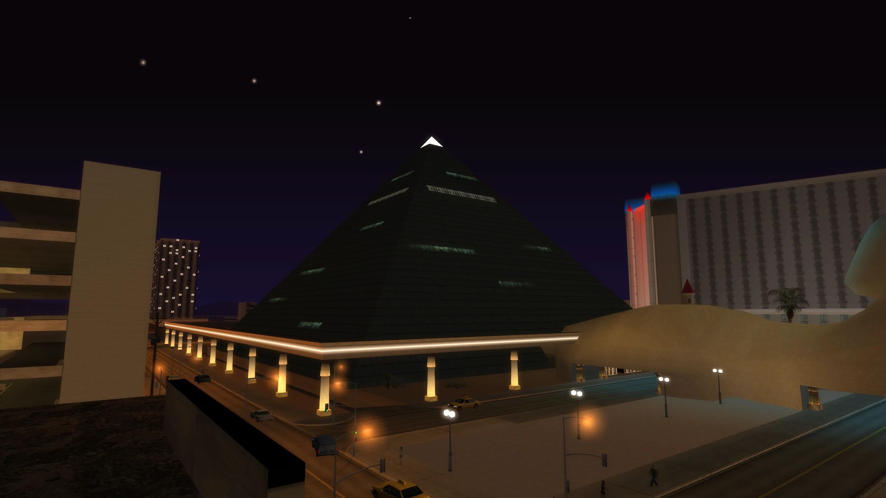

!!! warning
    This mod is now depricated and has instead been integrated into [Improved 2DFX](../Improved-2DFX/index.md){:target="_blank"}. Future updates will no longer be made to this mod.

## What is it?

The pyramid in Las Venturas had iffy 2DFX. With this the coronas no longer turn on and off every 5 seconds or disappear at certain camera angles.

## Changelog

??? note "Click to view the full changelog"
    !!! info
        Exact files edited for each change will be in brackets () at the end of the change when possible.

    **v1.0.0** (17/05/2020)

    - Initial release.
    - Updated the pyramid 2DFX so the coronas now appear at every camera angle. (vgepyrmd_nt.dff)
    - Updated the pyramid 2DFX so only the top two coronas turn on and off every 5 seconds instead of all of the coronas. (vgepyrmd_nt.dff)

## Download and Installation

1. Download the latest version of the mod from your preferred source.

    - GTA SA: [GitHub](https://github.com/TJGM/SA.Pyramid2DFXFix/releases){target="_blank" rel="noopener"} or [Mega](https://mega.nz/folder/EyIx0LJL#D-nFOPs-vnXu7utr-2oYrw){target="_blank" rel="noopener"}.

2. Open the mod archive you downloaded and move the `Pyramid 2DFX Fix vX.Y.Z` folder from the archive into your `modloader` folder.

[Click here for older mod versions (if available)](https://github.com/TJGM/SA.Pyramid2DFXFix/releases){target="_blank" rel="noopener"}

## Screenshots

  
  

## Credits

- TJGM

All my mods are free to use, share and reuse in other mods. All I ask is that you give credit, thanks!
