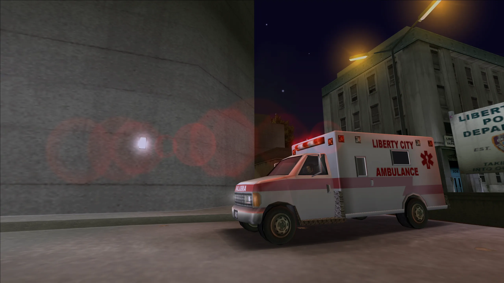

*SilentPatch just recieved its biggest content drop yet for the original GTA trilogy!*

<!-- more -->

## Introduction

The latest SilentPatch update just released and it includes a ton of fixes and improvements for the entire GTA trilogy.

## Changes

Here's a quick look at some of the biggest fixes...

### Entire Trilogy
- Fixed lens flare scaling so lens flare no longer gets smaller at higher resolutions.
- Changed refresh rate behaviour so the trilogy will now use your desktop refresh rate instead of always being at 60hz.

### GTA III
- Fixed gang spawns so they work as Rockstar originally intended. This should also stop gang members from freezing randomly.
- Boats can now be parked in garages without crashing.
- Police road blocks no longer spawn facing the wrong way if the road they spawn on has a rotation applied to it.
- NPCs can now use snipers and RPGs correctly.

### Vice City
- SWAT and FBI agents at roadblocks can now use their weapons.
- Heat haze from vehicle exhaust pipes now scales with resolution correctly (requires trails to be enabled).
- Boats now support extra components, this allows boats such as the Rio to spawn without the canopy roof like the vehicle designer intended.

### San Andreas
- Hundreds of lines of dialogue has been restored, these were mainly broken due to small errors or typos. This includes things like ammunation/barbershop owners having dialogue when spooked and CJ having dialogue when he takes over a turf.
- Rhino headlights have been restored.
- Incorrect beagle spawn at Fort Carson has been fixed.
- Cops no longer shoot like gangsters.

I've also worked with Silent on a video to cover many of the issues fixed by the mod, take a look below.

<iframe width="560" height="315" src="https://www.youtube.com/embed/C3ibU5WY7RM?si=JSQtEnfRipj5t4SS" title="YouTube video player" frameborder="0" allow="accelerometer; autoplay; clipboard-write; encrypted-media; gyroscope; picture-in-picture; web-share" referrerpolicy="strict-origin-when-cross-origin" allowfullscreen></iframe>

## Download

There's so much more fixed in this update and this is just a few of the highlights.

Check out Silent's [dedicated blog post](https://silentsblog.com/2026/07/31/silentpatch-2026-update){target="_blank" rel="noopener"} to see a full list of fixes with some great technical explanations and comparisons.

You can also find a download for the latest version of the mod there.