## Introduction
Fusion Fix adds new cheats to GTA IV and its episodes, some of these cheats are even hidden throughout the map. You enter cheats as phone numbers using your in-game phone.

You can find all cheats and their locations (if available) below.

---

Other sections of the Fusion Fix Wiki.

- [Configuration File](../Fusion-Fix-Wiki/config.md)
- [Download & Installation](../Fusion-Fix-Wiki/download.md)
- [Fixes & Improvements](../Fusion-Fix-Wiki/fixes.md)
- [In-Game Options](../Fusion-Fix-Wiki/options.md)

## All Episodes

### Speed up Physics Simulation

*Number:*

692-555-0100

*Location:*

This cheat can be found on a sign on a wall in the Amusement Park at Firefly Island.

*Slide to the right to see location on map, slide to the left to see location in-game.*

  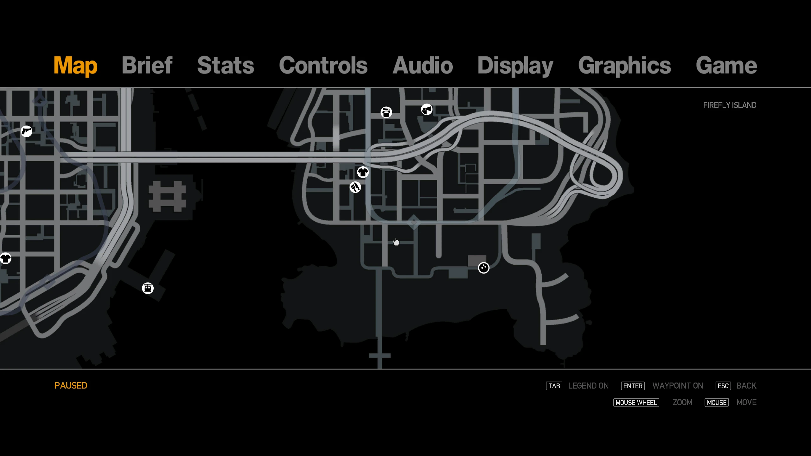
  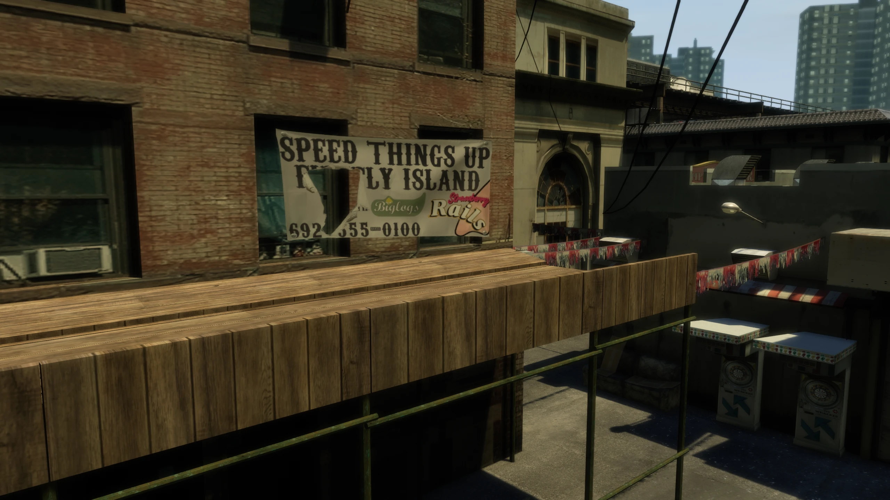

### Winter Seasonal Event 

This cheat manually enables Fusion Fix's winter [seasonal event](../Fusion-Fix-Wiki/fixes.md/#seasonal-events){target="_blank"}.

Outside of this cheat, this seasonal event activates automatically on the 30th of December and deactivates on the 3rd of January as long as the [seasonal event option](../Fusion-Fix-Wiki/options.md/#seasonal-events-new){target="_blank"} is enabled.

*Number:*

766-555-0100

*Location:*

This cheat can be found at two locations. Graffiti on the stairs in the Broker safehouse and on a newspaper in the Alterney safehouse.

*Slide to the right to see location on map, slide to the left to see location in-game.*

  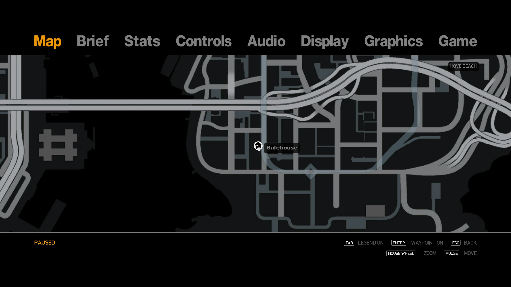
  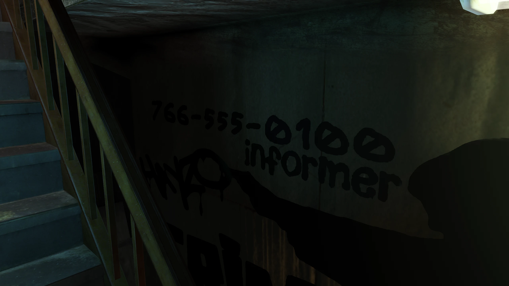

  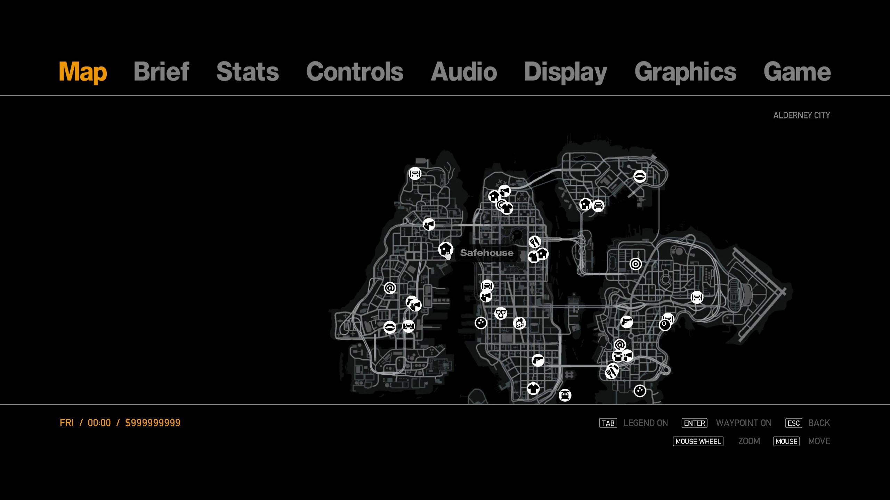
  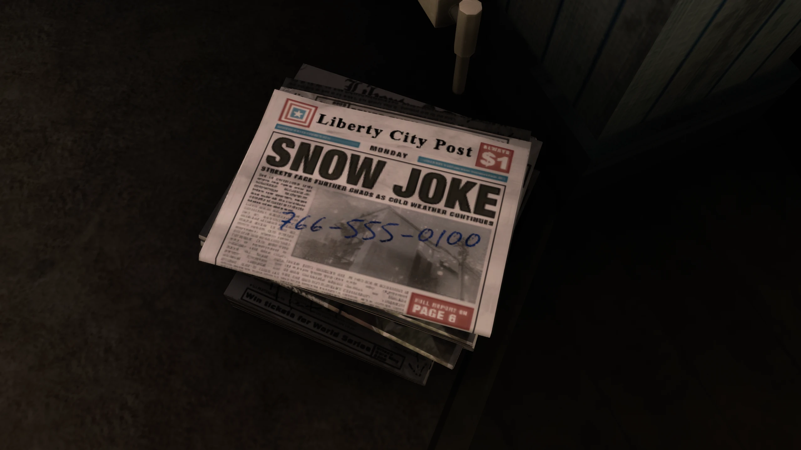

### Halloween Seasonal Event 

This cheat manually enables Fusion Fix's Halloween [seasonal event](../Fusion-Fix-Wiki/fixes.md/#seasonal-events).

Outside of this cheat, this seasonal event activates automatically on the 31st of October and deactivates on the 1st of November as long as the [seasonal event option](../Fusion-Fix-Wiki/options.md/#seasonal-events-new) is enabled.

*Number:*

266-555-0100

*Location:*

This cheat can be found as graffiti on a wall in northern Algonquin.

*Slide to the right to see location on map, slide to the left to see location in-game.*

  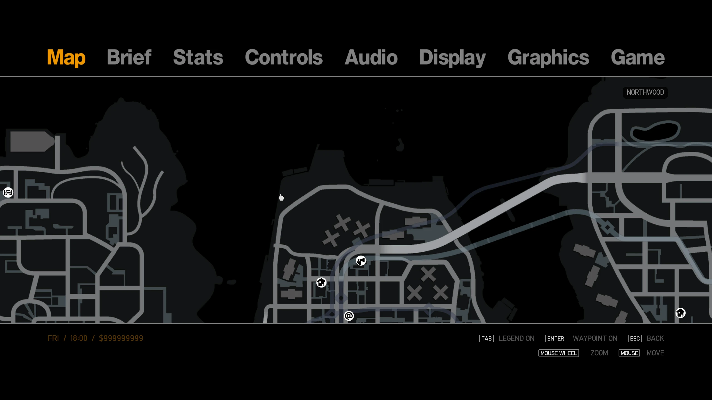
  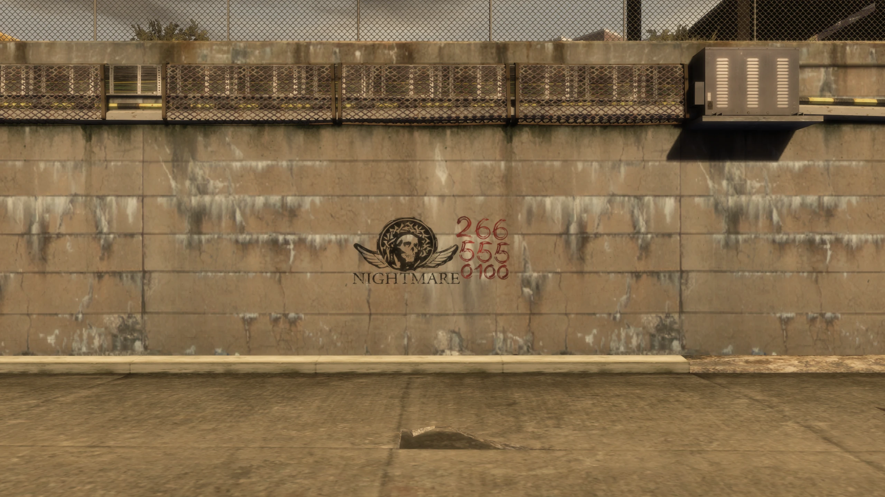

## Grand Theft Auto IV

### Cut Fingerless Gloves 

This cheats gives Niko the fingerless gloves that were seen in the games promotional material, but were never accessible in the final game.

*Number:*

458-555-0100

*Location:*

This cheat can be found on a sign on a wall in the Russian Shop at Hove Beach.

*Slide to the right to see location on map, slide to the left to see location in-game.*

  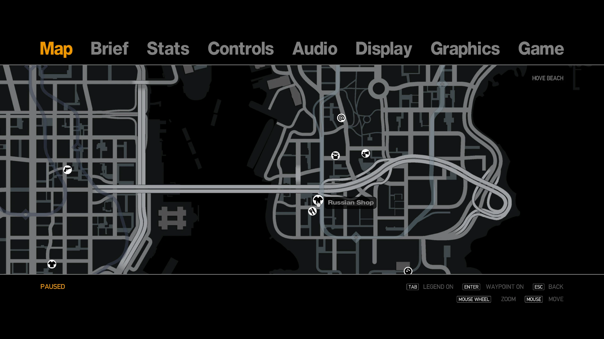
  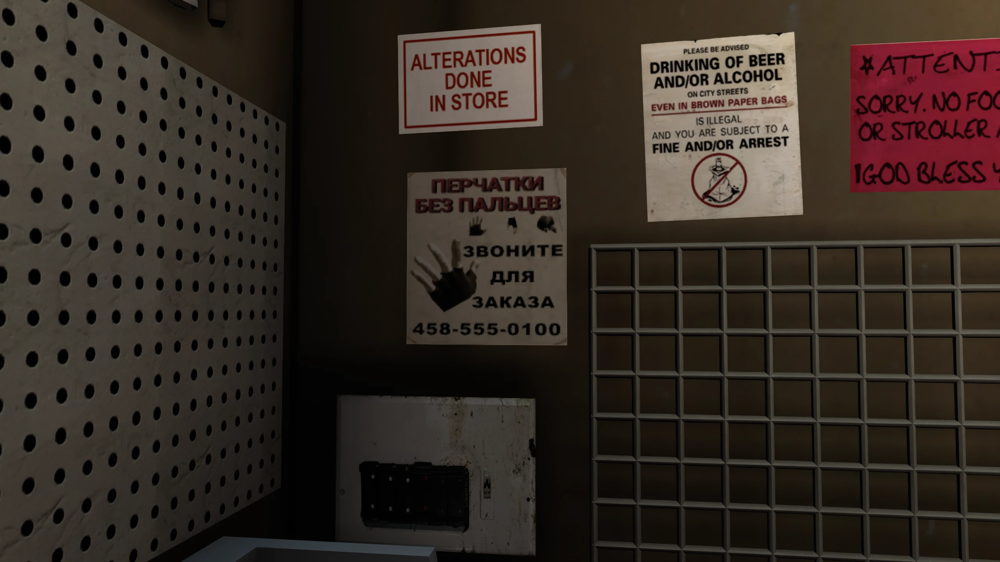

### Beta Haircut 

This cheats gives Niko his haircut that was seen in most of the games promotional material, but was never accessible in the final game.

*Number:*

288-555-0100

*Location:*

This cheat can be found as graffiti on the mirrors of the Middle Park toilets.

*Slide to the right to see location on map, slide to the left to see location in-game.*

  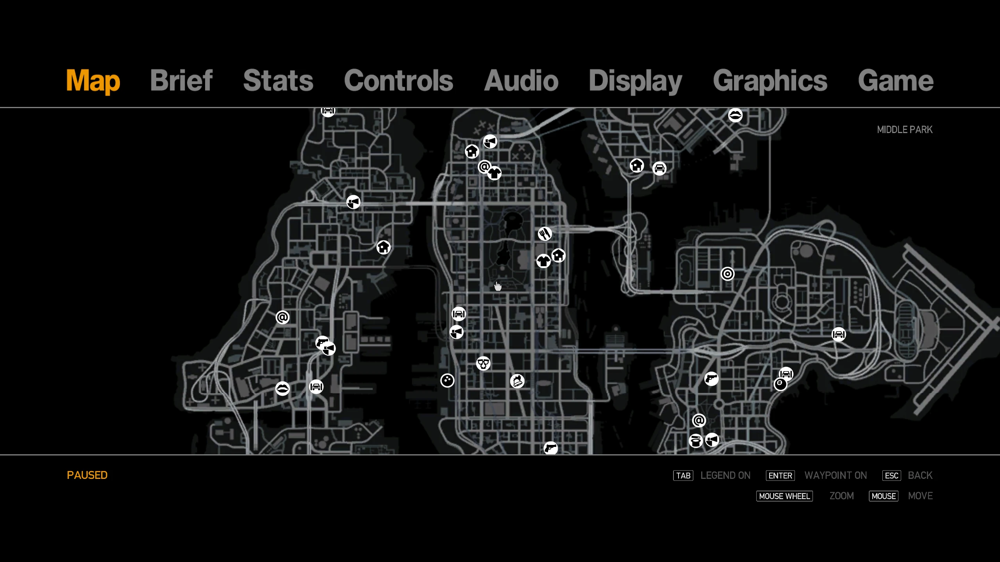
  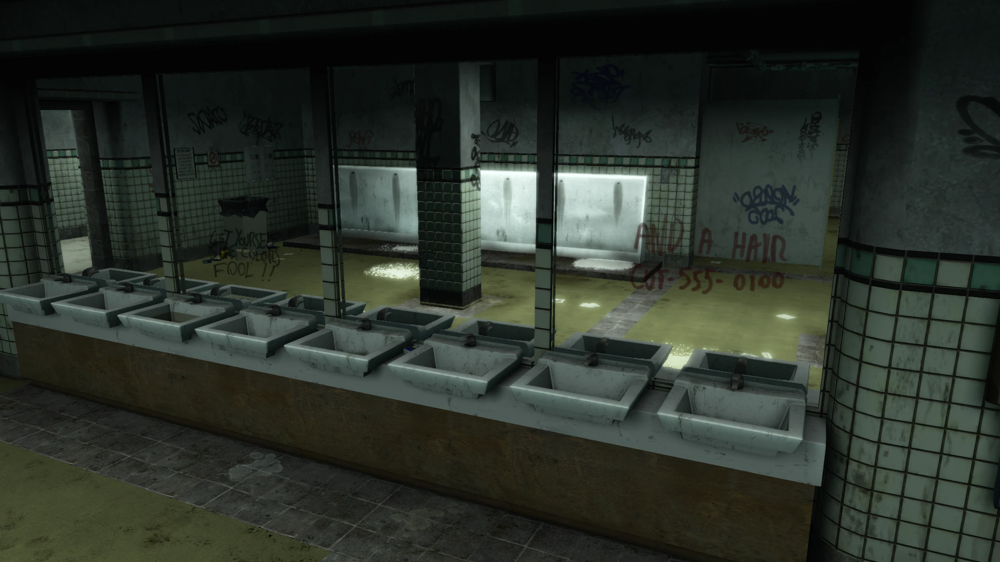

## The Ballad of Gay Tony

### Spawn Double-T 

*Number:*

245-555-0125

### Spawn Hakuchou 

*Number:*

245-555-0199

### Spawn Hexer 

*Number:*

245-555-0150

### Spawn Slamvan 

*Number:*

826-555-0100

### Spawn Police Vehicles

The cheats to spawn police vehicles can be found together at the police station in central Algonquin.

  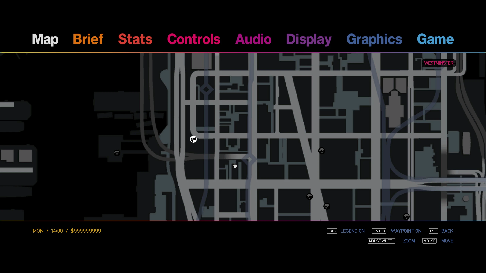
  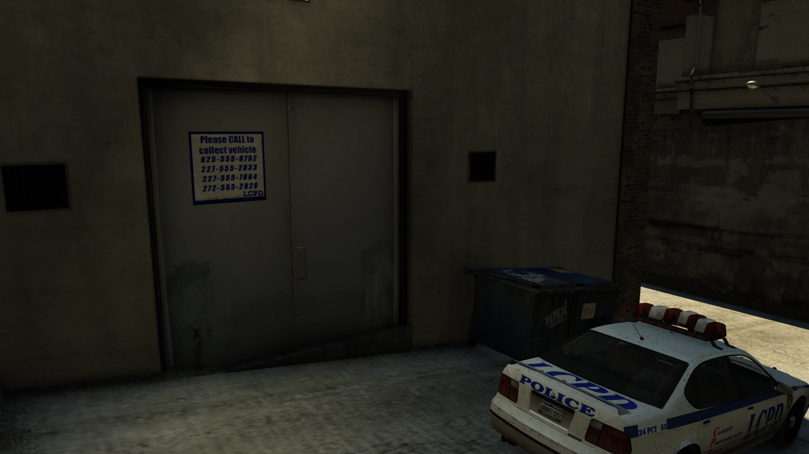

#### Spawn Police Bike

*Number:*

625-555-6752

#### Spawn Police Buffalo

*Number:*

227-555-2833

#### Spawn Police Stinger

*Number:*

227-555-7864

#### Spawn Brickade

*Number:*

272-555-2826

## The Lost and Damned

### Cut Black Pants 

*Number:*

726-555-0100

*Location:*

This cheat can be found written on a cardboard box on the second floor of Brian's safehouse.

*Slide to the right to see location on map, slide to the left to see location in-game.*

  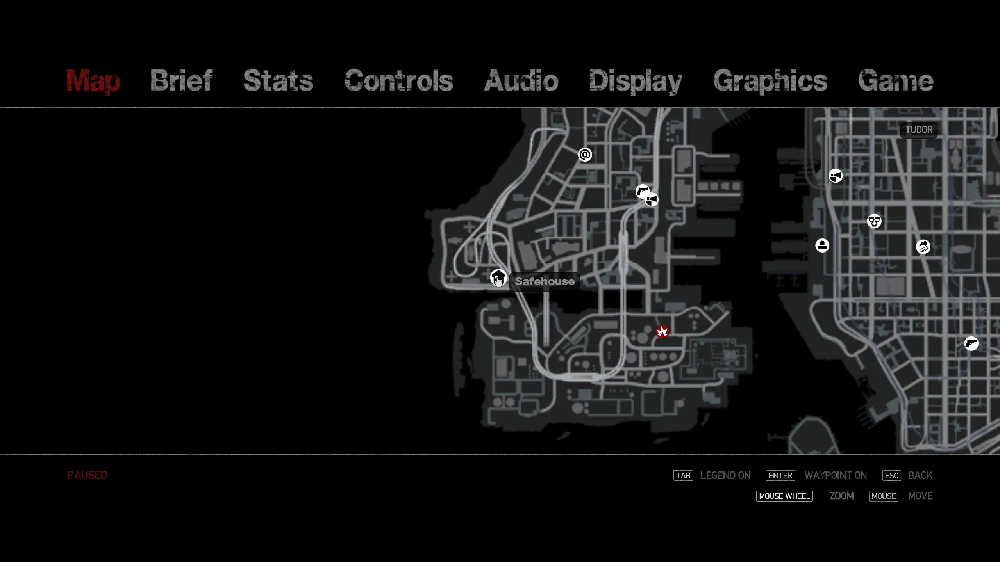
  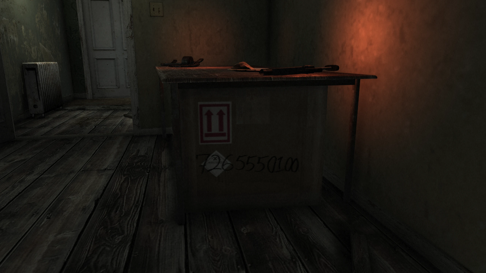

### Spawn Tampa 

*Number:*

227-555-8267