## Introduction
Fusion Fix provides a configuration file that gives you access to more advanced options and fine-tuning customization. You can edit this configuration file by opening `GTAIV.EFLC.FusionFix.ini` with any text editor.

Below you can find a description of each option.

---

Other sections of the Fusion Fix Wiki.

- [Download & Installation](../Fusion-Fix-Wiki/download.md)
- [Fixes & Improvements](../Fusion-Fix-Wiki/fixes.md)
- [In-Game Options](../Fusion-Fix-Wiki/options.md)
- [New Cheats](../Fusion-Fix-Wiki/cheats.md)

## [MAIN]

This section contains general settings which changes the behaviour of some Fusion Fix improvements.

### RecoilFix

*Description:*

On console, guns would increasingly become less accurate the longer you held the trigger, which made burst firing/single firing necessary to gun fights and made each weapon unique to certain situations. But on PC, guns will always shoot exactly where your crosshair is no matter what gun you're using and no matter how long you hold the trigger, simplyfying gameplay and allowing you to use weapons like an SMG at long distances with no downsides.

This setting enables a fix which makes guns behave the way Rockstar always intended.

*Comparisons:*

<div class="compare-container">
  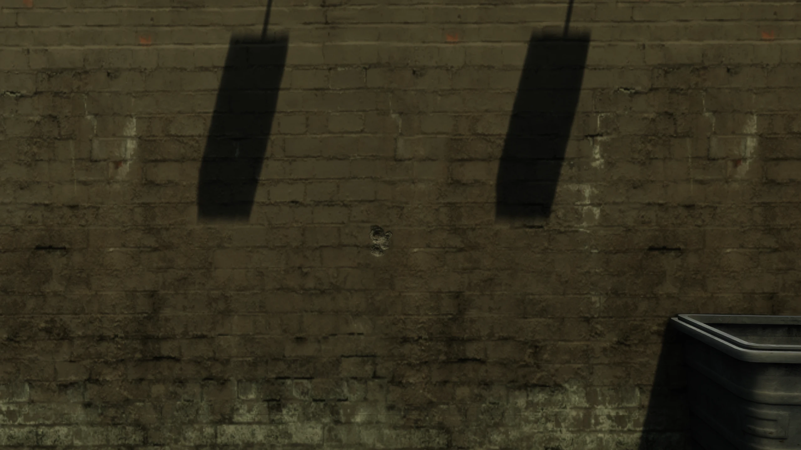
  
</div>

*Values:*

- `RecoilFix = 0` - Use PC behaviour
- `RecoilFix = 1` - Use console behaviour (Fusion Fix default)

### AimingZoomFix

*Description:*

In The Ballad of Gay Tony on PC, everytime you aimed a weapon it would be in the second zoomed state (usually triggered by scrolling up and down in the base game and The Lost and Damned).

This setting enables a fix which makes weapon zooming in The Ballad of Gay Tony behave like it did on the Xbox 360. It starts in the first zoomed state and then it remembers your last zoomed state when you stop aiming and even when you switch weapons. So if you zoom in with a pistol while aiming and then swap to an SMG, the SMG will still be zoomed in when you first aim unless you zoom out intentionally.

Values:

- `AimingZoomFix = -1` - The Ballad of Gay Tony aiming zoom behaves like the base game and The Lost and Damned. Starts in the first zoomed state, but will reset everytime you unaim or switch weapons
- `AimingZoomFix = 0` - Completely disables the fix
- `AimingZoomFix = 1` - The Ballad of Gay Tony aiming zoom behaves like it did on the Xbox 360. Starts in first zoomed state, but will remember your choice everytime you unaim or switch weapons (Fusion Fix default)
- `AimingZoomFix = 2` - Enables The Ballad of Gay Tony aiming zoom behaviour from the Xbox 360 on the base game and both episodes. Starts in first zoomed state, but will remember your choice everytime you unaim or switch weapons

## [CAMERASENSITIVITY]

This section contains settings which change the behaviour of the improved camera sensitivity sliders added by Fusion Fix.

### MouseLookSensitivityRange

*Description:*

Sets what the minimum (slowest) and maximum (fastest) sensitive is for the [mouse look sensitivty slider](index.md){:target="_blank"}. This slider is only for mouse input and it doesn't affect the sensitivty when aiming with weapons.

*Values:*

Values for this setting can be whatever you like. Left value is the minimum, right is the maximum.

- `MouseLookSensitivityRange = 0.1, 2.0` (Fusion Fix Default)

### GamepadLookSensitivityRange

*Description:*

Sets what the minimum (slowest) and maximum (fastest) sensitive is for the [gamepad look sensitivty slider](index.md){:target="_blank"}. This slider is only for gamepad input and it doesn't affect the sensitivty when aiming with weapons.

*Values:*

Values for this setting can be whatever you like. Left value is the minimum, right is the maximum.

- `GamepadLookSensitivityRange = 0.1, 2.0` (Fusion Fix Default)

### MouseAimSensitivityRange

*Description:*

Sets what the minimum (slowest) and maximum (fastest) sensitive is for the [mouse aim sensitivty slider](index.md){:target="_blank"}. This slider is only for mouse input and it only affects the sensitivty when aiming with weapons.

*Values:*

Values for this setting can be whatever you like. Left value is the minimum, right is the maximum.

- `MouseAimSensitivityRange = 0.1, 2.0` (Fusion Fix Default)

### GamepadAimSensitivityRange

*Description:*

Sets what the minimum (slowest) and maximum (fastest) sensitive is for the [gamepad aim sensitivty slider](index.md){:target="_blank"}. This slider is only for gamepad input and it only affects the sensitivty when aiming with weapons.

*Values:*

Values for this setting can be whatever you like. Left value is the minimum, right is the maximum.

- `GamepadAimSensitivityRange = 0.1, 2.0` (Fusion Fix Default)

## [SHADOWS]

This section contains settings related to the games shadows.

### ExtraDynamicShadows

*Description:*

Several objects don't cast shadows in GTA IV. This setting enables a flag which allows them to cast shadows.

*Comparisons:*

<div class="compare-container">
  
  
</div>

<div class="compare-container">
  
  
</div>

<div class="compare-container">
  
  
</div>

*Values:*

- `ExtraDynamicShadows = 0` - Disabled
- `ExtraDynamicShadows = 1` - More vegetation models cast shadows
- `ExtraDynamicShadows = 2` - Certain fences, walls, roads, grates and more vegetation models cast shadows (Fusion Fix default)

### CascadeBlendSize

*Description:*

Cascaded shadows use higher-resolution shadow maps close to the player and lower-resolution shadow maps further away. This setting controls the size of the transition area where these shadow cascades blend together.

*Comparisons:*

<div class="compare-container">
  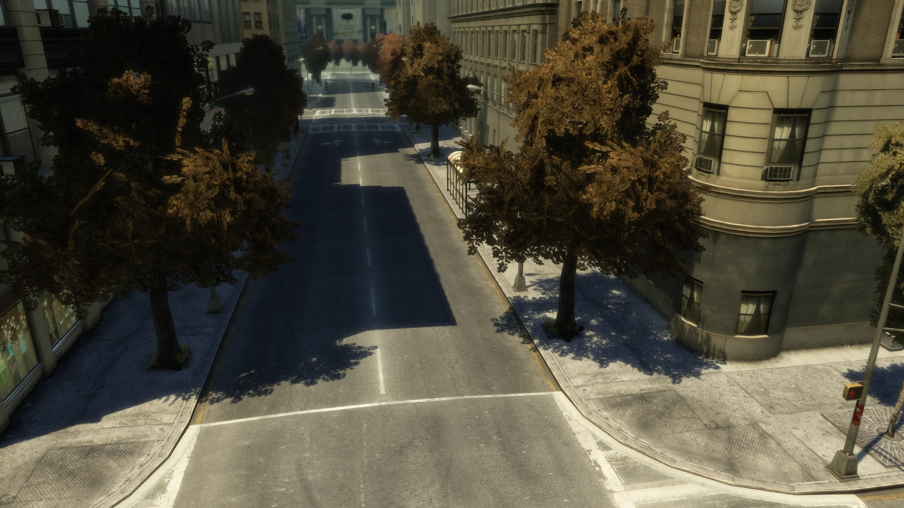
  
</div>

*Values:*

This setting works both ways, so a higher value here will increase the transition area further away from the player as well as closer to the player. This option can range from 0.0 to 1.0.

- `CascadeBlendSize = 0.1` (Fusion Fix default)

### HighResolutionShadows

*Description:*

Doubles the cascaded shadow map resolution. So if the shadow resolution near the player was 1024x1024, it now becomes 2048x2048. This doubling of shadow resolution also applies to lower-resolution shadow maps further away.

*Comparisons:*

These comparisons were made using the Sharp shadow filter.

<div class="compare-container">
  
  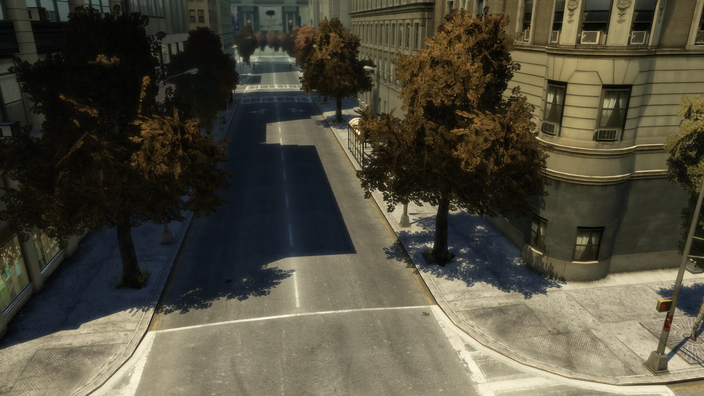
</div>

<div class="compare-container">
  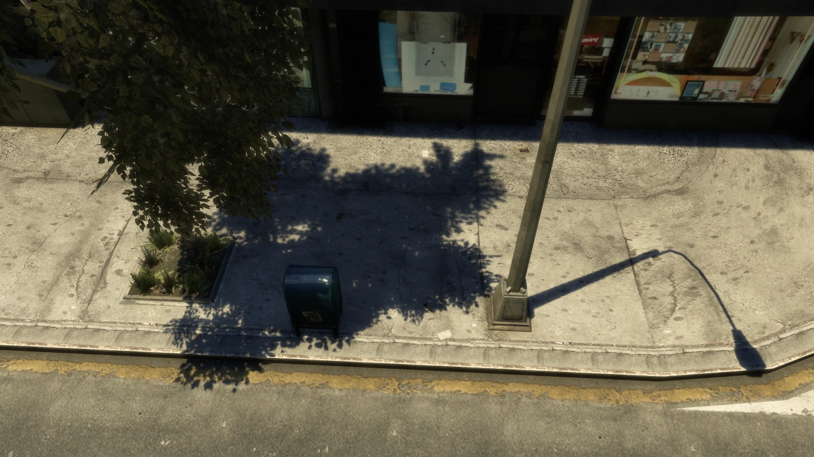
  
</div>

<div class="compare-container">
  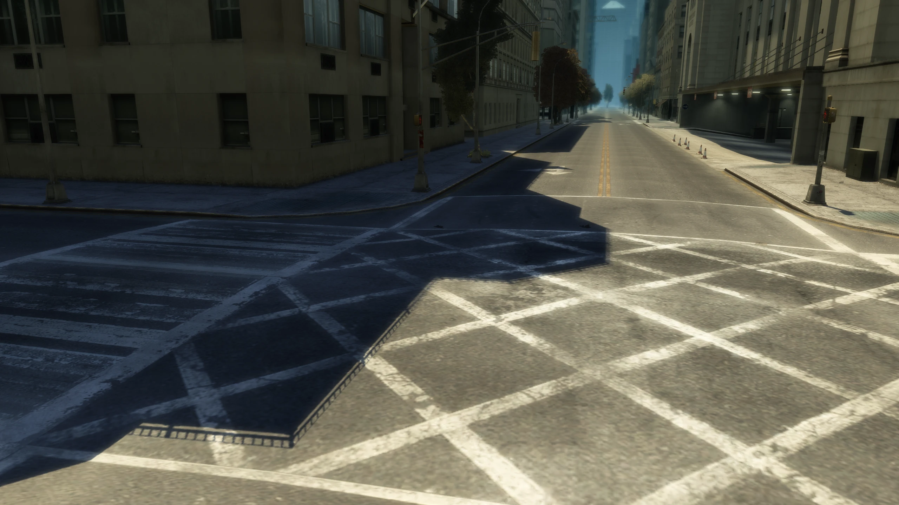
  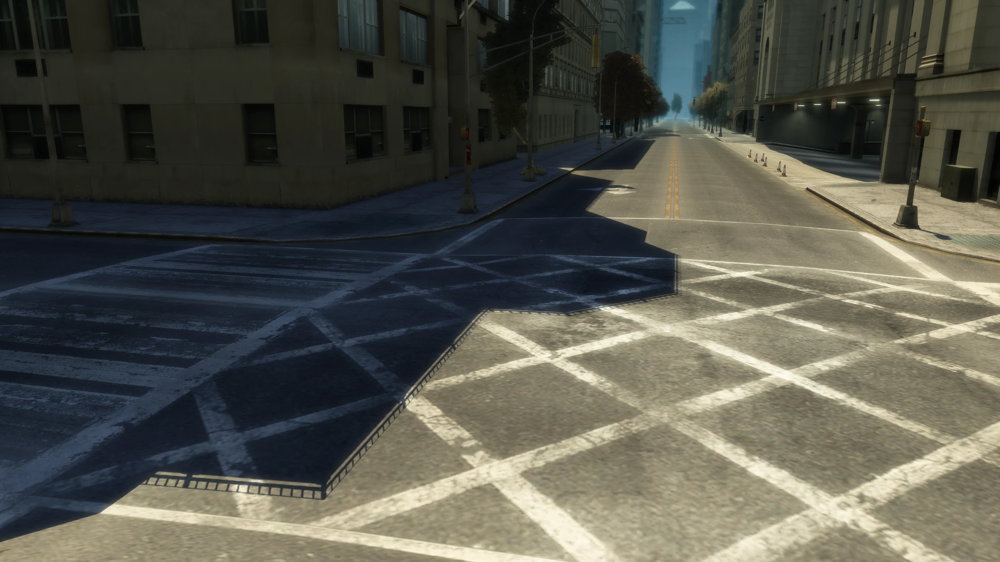
</div>

*Values:*

- `HighResolutionShadows = 0` - Disabled (Fusion Fix default)
- `HighResolutionShadows = 1` - Doubles shadow resolution, very performance heavy.

### ForceShadowFilter

*Description:*

Forces a specific shadow filter instead of it being tied to [Fusion Fix's reworked definition option](../Fusion-Fix-Wiki/fixes.md/#definition){:target="_blank"}, I'd recommend reading about that if you want to understand what this really does.

This setting is not related to the [shadow filter option added by Fusion Fix](../Fusion-Fix-Wiki/options.md/#shadow-filter-new){:target="_blank"}, which are seperate effects.

*Comparisons:*

<div class="compare-container">
  
  
</div>

*Values:*

- `ForceShadowFilter = 0` - Filter quality tied to the definition option
- `ForceShadowFilter = 1` - Uses the low quality shadow filter seen on Xbox 360
- `ForceShadowFilter = 2` - Uses the new high quality Fusion Fix shadow filter, which gives you the cleanest shadows out of any platform (Fusion Fix default)

## [FRAMELIMIT]

This section contains settings which change the behaviour of Fusion Fix's frame limiter.

### FrameLimitType

*Description:*

Changes how Fusion Fix's frame rate limiter limits your frame rate.

*Values:*

- `FrameLimitType = 1` - Thread-lock. This can technically provide more stable frame pacing and lower input latency, but it uses more CPU resources
- `FrameLimitType = 2` - Sleep-yield. This can technically have less stable frame pacing, but it uses signifcantly less CPU resources (Fusion Fix default)

### FpsLimit

*Description:*

Sets the frame rate used when the [FPS limiter](../Fusion-Fix-Wiki/options.md/#fps-limiter-new){:target="_blank"} option is set to "Custom".

*Values:*

Any numerical value can be used for this setting. Negative values make the "Custom" option default to your refresh rate.

- `FpsLimit = -2 (Fusion Fix default)`

### CutsceneFpsLimit

*Description:*

Limits the frame rate during the games cutscenes to a certain value. Cutscenes had some major issues above 30FPS, but Fusion Fix fixes most of them, so this isn't really necessary to set.

*Values:*

Any numerical value can be used for this setting.

- `CutsceneFpsLimit = 0 (Fusion Fix default)`

### LoadingFpsLimit

*Description:*

Limits the frame rate during the games loading sections (black screen with text in the bottom right) to a certain value. The FPS often spikes into the hundreds/thousands when the game is loading, this causes an increase in GPU usage and it can sometimes soft lock the game.

*Values:*

Any numerical value can be used for this setting.

- `LoadingFpsLimit = 30 (Fusion Fix default)`

### UnlockFramerateDuringLoadscreens

*Description:*

Unlocks the frame rate when the game is loading a save/new game (when the loading screen art is on-screen) which reduces loading times.

*Values:*

- `UnlockFramerateDuringLoadscreens = 1` - Unlocked frame rate (Fusion Fix default)
- `UnlockFramerateDuringLoadscreens = 0` - Frame rate remains locked to the [FPS limit](../Fusion-Fix-Wiki/options.md/#fps-limiter-new){:target="_blank"} during load screens

### MinigamesFpsLimit

*Description:*

Sets a specific FPS limit for the minigames listed in [MinigamesList](#minigameslist), as these often break at higher frame rates.

*Values:*

Any numerical value can be used for this setting.

- `MinigamesFpsLimit = 30 (Fusion Fix default)`

### MinigamesList

*Description:*

Selects which minigames will be affected by the [MinigamesFpsLimit](#minigamesfpslimit).

*Values:*

Entries for this setting should be seperated by a comma. For example, if you only want air hockey and arm wrestling for this setting, it should look like ```MinigamesList = air_hockey, arm_wrestling```

- `MinigamesList = pool_game (Fusion Fix default)`
- `MinigamesList = air_hockey (Fusion Fix default)`
- `MinigamesList = arm_wrestling (Fusion Fix default)`
- `MinigamesList = tenpinbowl (Fusion Fix default)`
- `MinigamesList = darts (Fusion Fix default)`
- `MinigamesList = drinking (Fusion Fix default)`

## [MISC]

This section contains several settings that don't fit in any other section.

### DefaultCameraAngleInTLaD

*Description:*

The Lost and Damned uses a different camera angle when the player is on a bike compared to the base game and The Ballad of Gay Tony. This setting forces the standard IV camera angle while playing The Lost and Damned.

*Values:*

- `DefaultCameraAngleInTLaD = 1` - Enabled (Fusion Fix default)
- `DefaultCameraAngleInTLaD = 0` - Disabled

### PedDeathAnimFixFromTBoGT

*Description:*

There's an additional death animation that NPCs do after you use a counter attack in hand-to-hand combat in the base game and The Lost and Damned, this looks quite strange and could be considered a bug. The Ballad of Gay Tony fixes this issue and this setting enables that fix in the base game and The Lost and Damned.

*Values:*

- `PedDeathAnimFixFromTBoGT = 1` - Enabled (Fusion Fix default)
- `PedDeathAnimFixFromTBoGT = 0` - Disabled

### DisableCameraCenteringInCover

*Description:*

The vanilla game will automatically center and temporarily lock the camera when you get to the edge of cover. This setting stops that behaviour.

*Comparisons:*

<video width="100%" controls>
  <source src="../../../../assets/shared/fusionfix/config/DisableCameraCenteringInCover.mp4" type="video/mp4">
</video>

*Values:*

- `DisableCameraCenteringInCover = 1` - Enabled (Fusion Fix default)
- `DisableCameraCenteringInCover = 0` - Disabled

### ExtraInfo

*Description:*

Shows extra information at the bottom of the pause menu, such as Fusion Fix version and how many IMG files are loaded.

*Comparisons:*

<div class="compare-container">
  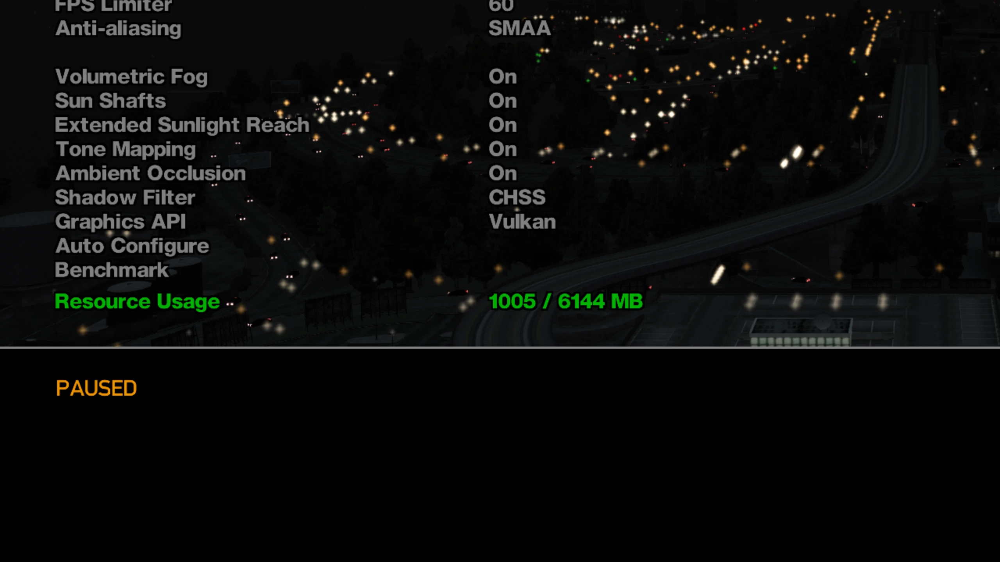
  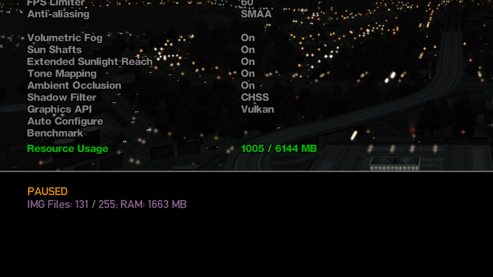
</div>

<div class="compare-container">
  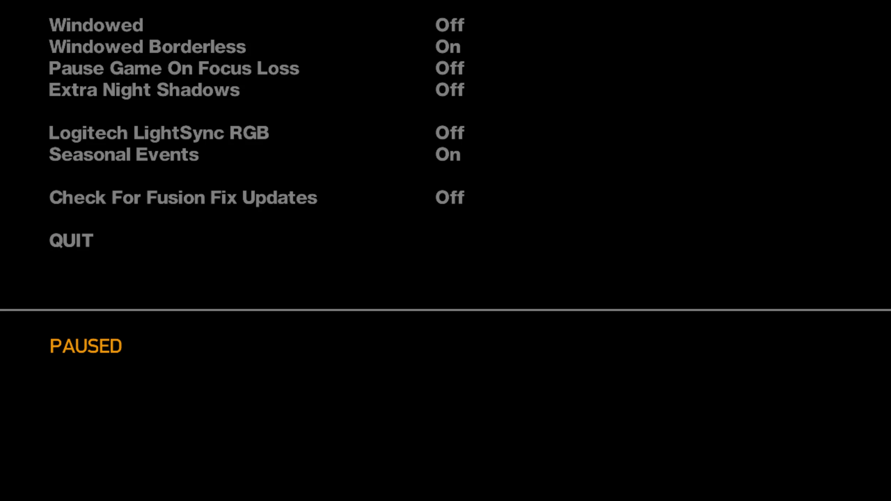
  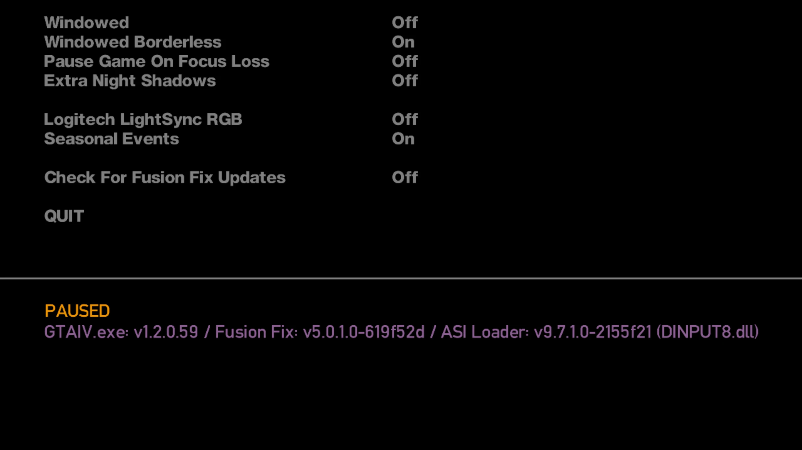
</div>

*Values:*

- `ExtraInfo = 1` - Enabled (Fusion Fix default)
- `ExtraInfo = 0` - Disabled

### OverrideTreeAlpha

*Description:*

Overrides the [tree alpha option](../Fusion-Fix-Wiki/options.md/#tree-alpha-new){:target="_blank"} by setting a specific value.

*Comparisons:*

<div class="compare-container">
  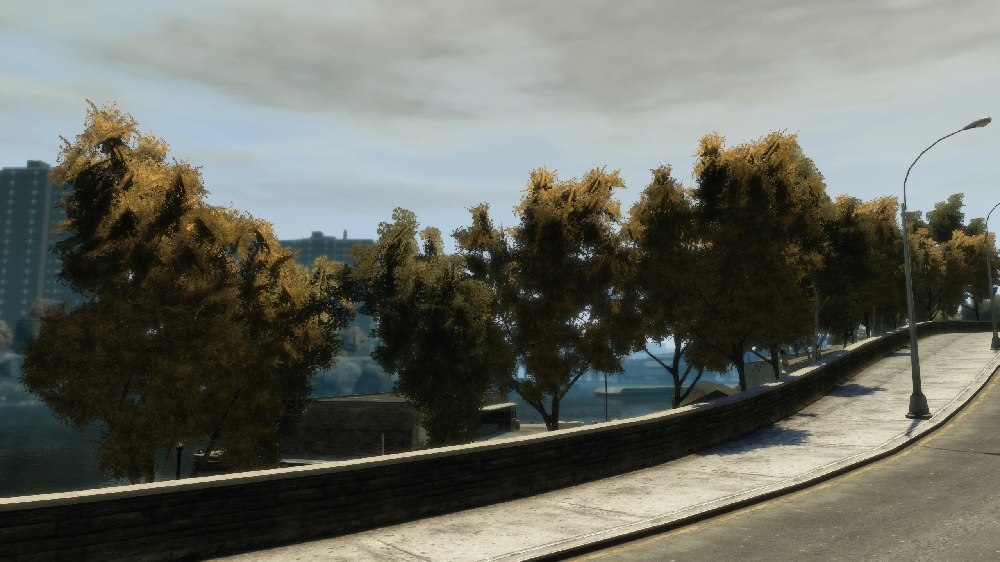
  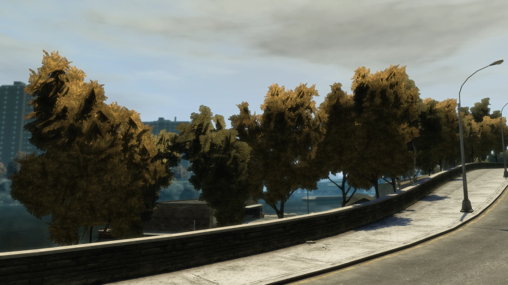
  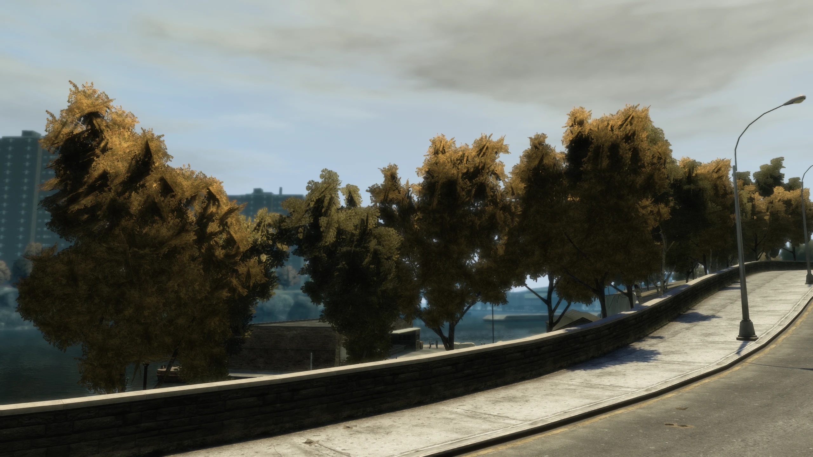
</div>

*Values:*

Any numerical value can be used for this setting. You can find the respective tree alpha value for each platform below.

- `OverrideTreeAlpha = 0.0` - Uses the fixed tree alpha values from the [tree alpha](../Fusion-Fix-Wiki/options.md/#tree-alpha-new){:target="_blank"} option (Fusion Fix default)
- `OverrideTreeAlpha = 0.625` - PC alpha setting
- `OverrideTreeAlpha = 2.5` - PS3 alpha setting
- `OverrideTreeAlpha = 4.0` - Xbox 360 alpha setting

### ConsoleCarReflectionsAndDirt

*Description:*

Car reflections were stronger on console and any car could be dirty when it spawned on console, which wasn't the case on PC. This setting enables and disables those improvements.

*Comparisons:*

<div class="compare-container">
  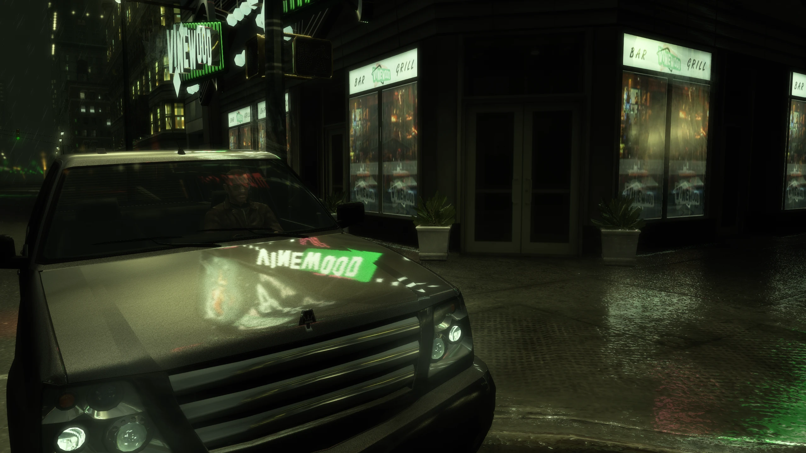
  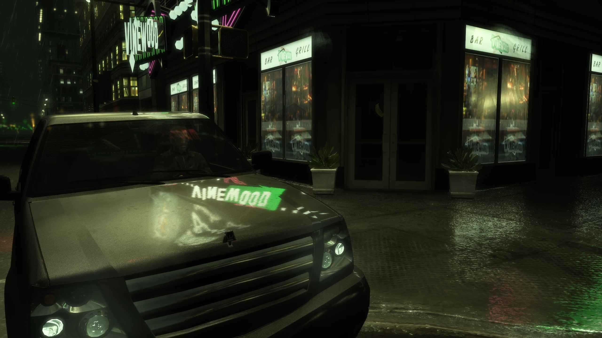
</div>

*Values:*

- `ConsoleCarReflectionsAndDirt = 1` - Enabled (Fusion Fix default)
- `ConsoleCarReflectionsAndDirt = 0` - Disabled (Doesn't seem to work right now)

### BrakeLightsWhenStopped

*Description*

When you stop in a car, the brake lights will remain on until you start moving again.

*Values*

- `BrakeLightsWhenStopped = 1` - Enabled
- `BrakeLightsWhenStopped = 0` - Disabled (Fusion Fix default)

### FixHelicopterSearchlights

*Description*

Helicopter searchlights are broken in GTA IV on PC and will flicker on and off when more than one is active. This setting allows you to alter how the fix for this issue behaves or disable it entirely.

*Values*

- `FixHelicopterSearchlights = 0` - Disabled
- `FixHelicopterSearchlights = 1` - Enables a workaround fix by allowing one searchlight at a time from each helicopter for 10 seconds (Fusion Fix default)
- `FixHelicopterSearchlights = 2` - Allows all searchlights to work independently

### AlwaysDisplayHealthOnReticle

*Description:*

When playing with mouse and keyboard, the health of NPCs doesn't show when you aimed at them like it did with a controller. This setting enables and disables that feature.

*Comparisons:*

<div class="compare-container">
  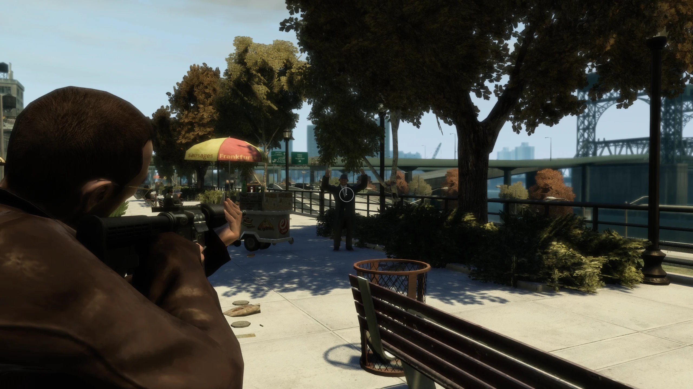
  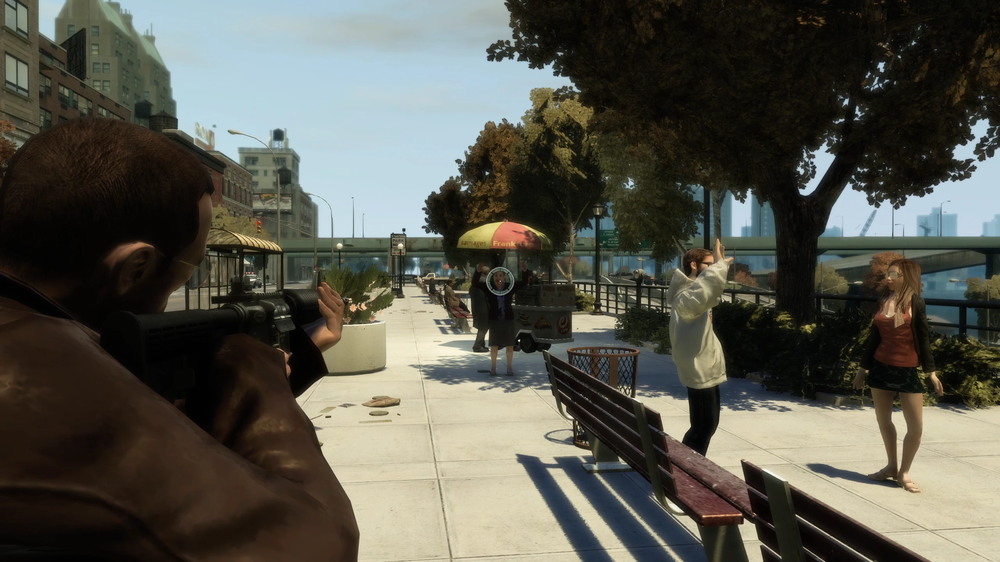
</div>

*Values:*

- `AlwaysDisplayHealthOnReticle = 1` - Enabled (Fusion Fix default)
- `AlwaysDisplayHealthOnReticle = 0` - Disabled

### SmoothShorelines

*Description:*

Fusion Fix improves the edges of water so they no longer harshly cut off and it also adjusts the noise on water foam (which it also restores). This setting enables and disables those improvements.

*Comparisons:*

<div class="compare-container">
  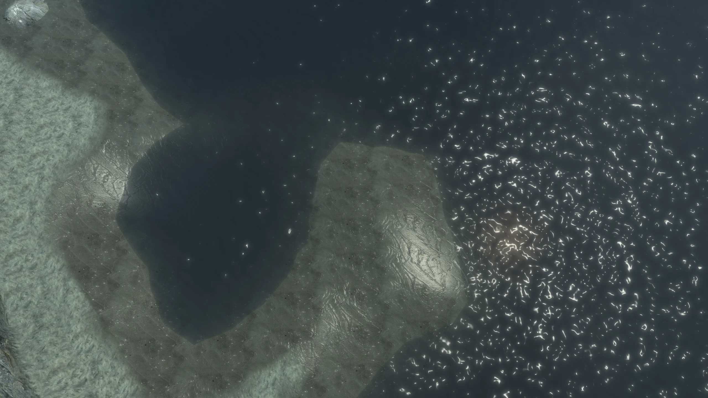
  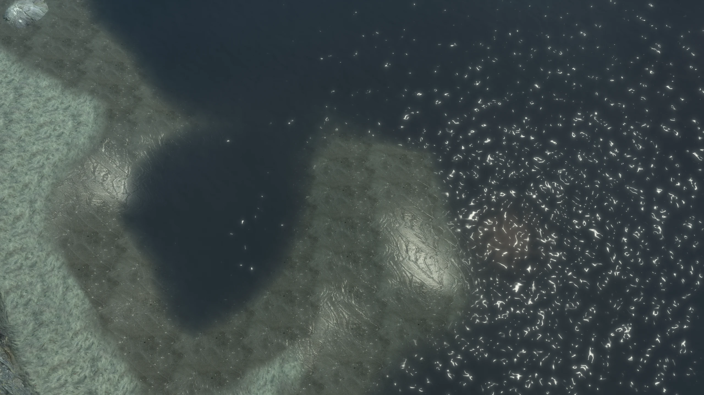
</div>

<div class="compare-container">
  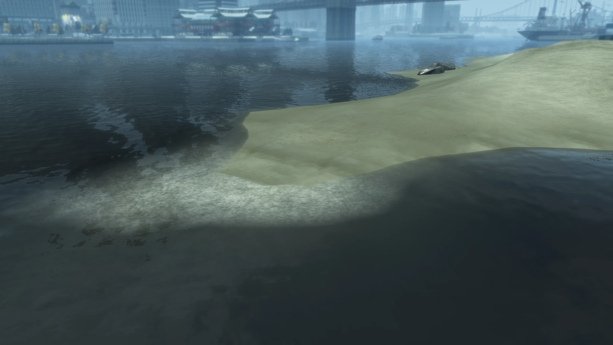
  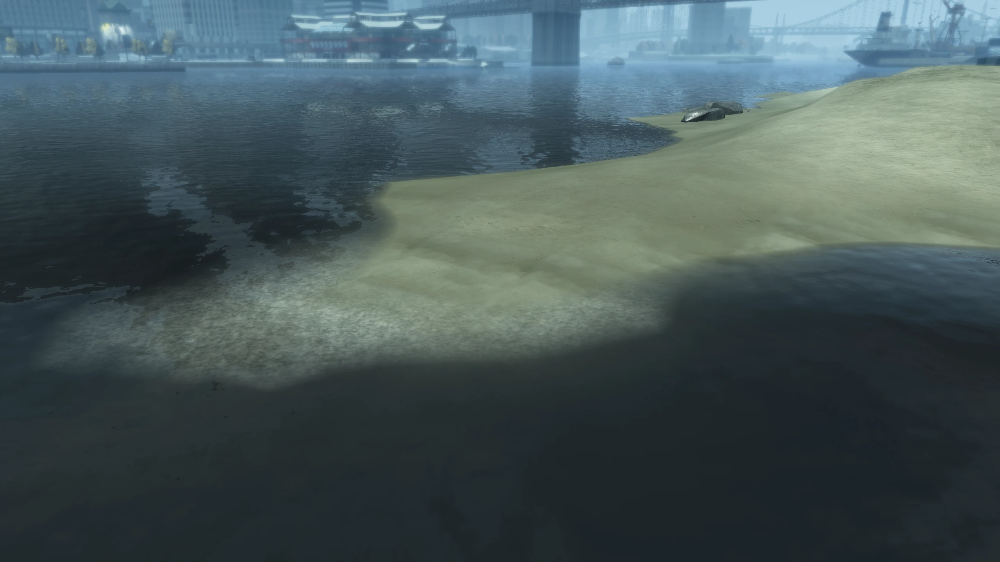
</div>

*Values:*

- `SmoothShorelines = 1` - Enabled (Fusion Fix default)
- `SmoothShorelines = 0` - Disabled

### SmoothLightVolumes

*Description:*

Fusion Fix improves light volumes so their edges fade nicer rather than sharply cutting off. This setting enables and disables that improvement.

*Comparisons:*

<div class="compare-container">
  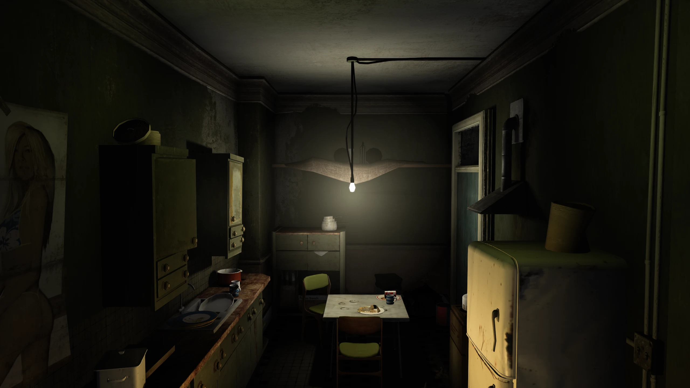
  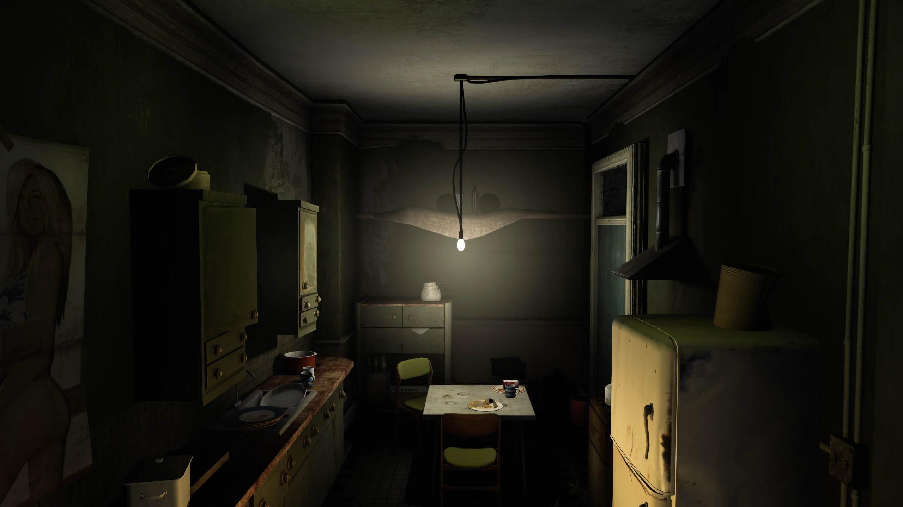
</div>

*Values:*

- `SmoothLightVolumes = 1` - Enabled (Fusion Fix default)
- `SmoothLightVolumes = 0` - Disabled

### NoBloomColorShift

*Description:*

Tone mapping can cause colour shifts when bloom is on, this prevents that. This setting enables and disables an improvement which prevents this.

*Values:*

- `NoBloomColorShift = 1` - Enabled (Fusion Fix default)
- `NoBloomColorShift = 0` - Disabled

### MenuEnteringDelay

*Description:*

Entering the pause menu in the vanilla game has a 400 millisecond delay due to the screen fading to black. This setting changes the lenght of this fade.

*Values:*

This setting uses a time based value. 100 is 1 millisecond, 1000 is 1 second.

- `MenuEnteringDelay = 0` - No delay (Fusion Fix default)
- `MenuEnteringDelay = 400` - 4 milliseconds, vanilla game behaviour

### MenuExitingDelay

*Description:*

Exiting the pause menu in the vanilla game has a 800 millisecond delay due to the screen fading from black. This setting changes the lenght of this fade.

*Values:*

This setting uses a time based value. 100 is 1 millisecond, 1000 is 1 second.

- `MenuExitingDelay = 0` - No delay (Fusion Fix default)
- `MenuExitingDelay = 800` - 4 milliseconds, vanilla game behaviour

### MenuAccessDelayOnStartup

*Description:*

When first loading in-game in the vanilla game, the game has a 3 second delay before it allows you to enter the pause menu (on top of the 400 millisecond delay due to [MenuEnteringDelay](#menuenteringdelay)). This setting changes the lenght of this delay.

*Values:*

This setting uses a time based value. 100 is 1 millisecond, 1000 is 1 second.

- `MenuAccessDelayOnStartup = 0` - No delay (Fusion Fix default)
- `MenuAccessDelayOnStartup = 3000` - 3 seconds, vanilla game behaviour

### RadarZoomDelay

*Description:*

When you zoom the radar out using the zoom radar key (d-pad down on a controller) in the vanilla game, the radar will zoom back in as soon as you release the key. This setting changes how long it'll take before the radar zooms back in after using this key.

*Values:*

This setting uses a time based value. 100 is 1 millisecond, 1000 is 1 second.

- `RadarZoomDelay = 0` - No delay, vanilla game behaviour
- `RadarZoomDelay = 3000` - 3 seconds (Fusion Fix default)

### DeathMusic

*Description:*

Enables or disables the cut music that plays when the player dies.

DeathMusic = 1
<video width="100%" controls muted>
  <source src="../../../../assets/shared/fusionfix/config/DeathMusic1.mp4" type="video/mp4">
</video>

*Values:*

- `DeathMusic = 1` - Enabled
- `DeathMusic = 0` - Disabled (Fusion fix default)

### AutoClimbLaddersRange

*Description*

Allows you to change the distance the player will automatically start to climb a ladder when [Auto Ladder Climb](../Fusion-Fix-Wiki/options.md/#auto-climb-ladders-new) is enabled.

*Values:*

- `AutoClimbLaddersRange = 1.5` - (Fusion Fix Default)

### PlayerJumpRagdollControl

*Description:*

Allows you to trigger a ragdoll on the player by pressing the reload button while jumping.

*Values*

- `PlayerJumpRagdollControl = 1` - Enabled
- `PlayerJumpRagdollControl = 0` - Disabled (Fusion fix default)

### PlayerClimbRagdollControl

*Description:*

Allows you to trigger a ragdoll on the player by pressing the reload button when in the middle of climbing, e.g. holding onto a ledge.

*Values*

- `PlayerClimbRagdollControl = 1` - Enabled
- `PlayerClimbRagdollControl = 0` - Disabled (Fusion fix default)

## [FOG]

This section contains settings related to the volumetric fog feature and the games timecycle.

### VolFogFarClip

*Description:*

When the [volumetric fog option](../Fusion-Fix-Wiki/options.md/#volumetric-fog-new){:target="_blank"} option is enabled, it overwrites the games farclip value inside ```timecyc.dat``` and instead forces the farclip to use the value set by this setting instead.

*Comparisons:*

<div class="compare-container">
  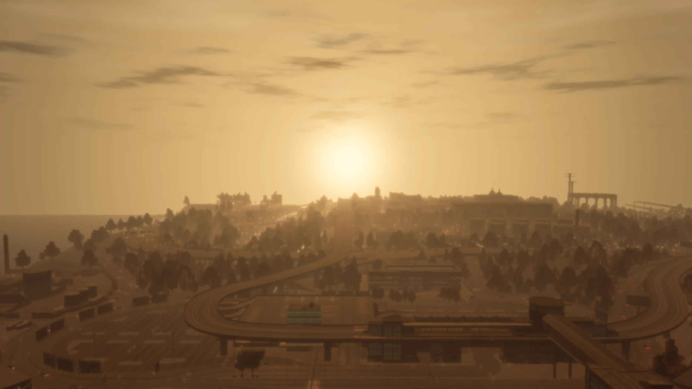
  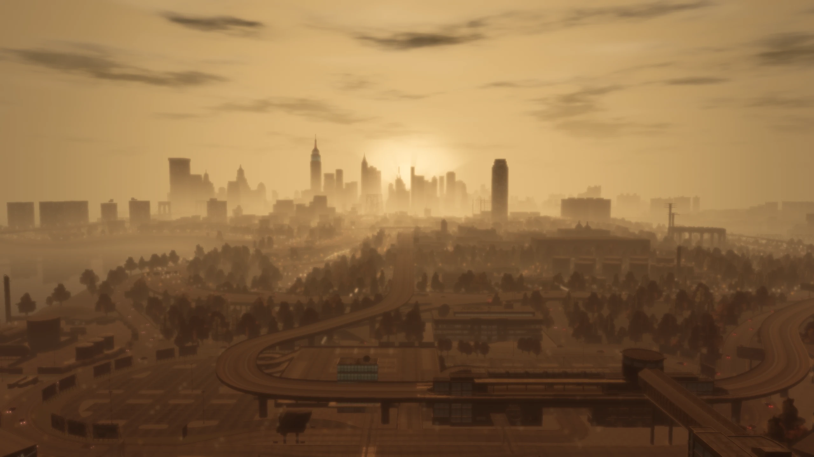
</div>

*Values:*

This setting uses a distance based value. 1 is meter, 1000 is 1000 meters.

- `VolFogFarClip = 4500 (Fusion Fix default)`

### ExtendedTimecycEditing

*Description:*

This setting enables debug information that is useful for modders editing the games `timecyc.dat` file. You can also refresh `timecyc.dat` while in-game by pressing F3.

*Values:*

- `ExtendedTimecycEditing = 1` - Enabled
- `ExtendedTimecycEditing = 0` - Disable (Fusion Fix default)

## [BudgetedIV]

This section contains settings related to the games memory budgets and limitations.

### VehicleBudget

*Description:*

[RIL.Budgeted](https://gtaforums.com/topic/744584-reliv-rilbudgeted-population-budget-adjustertaxi-bug-fix/){target="_blank" rel="noopener noreferrer"} is integrated into Fusion Fix and this setting allows you to adjust the vehicle budget, which is the amount of memory the game is allowed to use for vehicle streaming.

*Values:*

This setting is read in bytes. So to change the vehicle budget to 100 megabytes, you’d put one hundred million 100000000 here.

- `VehicleBudget = 0` - Game will use default vehicle budget set by Rockstar, which is 40 megabytes (Fusion Fix default)
- `VehicleBudget = 100000000` - 100 megabytes
- `VehicleBudget = 1000000000` - 1 gigabyte

### PedBudget

*Description:*

[RIL.Budgeted](https://gtaforums.com/topic/744584-reliv-rilbudgeted-population-budget-adjustertaxi-bug-fix/){target="_blank" rel="noopener noreferrer"} is integrated into Fusion Fix and this setting allows you to adjust the pedestrian (NPC) budget, which is the amount of memory the game is allowed to use for pedestrian streaming.

*Values:*

This setting is read in bytes. So to change the vehicle budget to 100 megabytes, you’d put one hundred million 100000000 here.

- `PedBudget = 0` - Game will use default vehicle budget set by Rockstar, which is 40 megabytes (Fusion Fix default)
- `PedBudget = 100000000` - 100 megabytes
- `PedBudget = 1000000000` - 1 gigabyte

### ExtendedLimits

*Description:*

This setting extends several game limits which mods may need increased in order to work. You shouldn't change this unless a mod tells you to.

*Values:*

- `ExtendedLimits = 1` - Enabled
- `ExtendedLimits = 0` - Disabled (Fusion Fix default)

## [EPISODICCONTENT]

This section contains settings related to assets/features added by the DLC episodes.

### EpisodicVehicles

*Description:*

Adds support for The Ballad of Gay Tony vehicles (APC, Buzzard, Smuggler, Floater and Blade.) and their abilities to the base game and The Lost and Damned.

You still need a mod which adds this content to the other episodes, such as [TACE.lite](https://www.nexusmods.com/gta4/mods/774){target="_blank" rel="noopener noreferrer"}.

*Values:*

- `EpisodicVehicles = 1` - Enabled
- `EpisodicVehicles = 0` - Disabled

### EpisodicWeapons

*Description:*

Adds support for the DLC weapons (DSR1, Grenade Launcher, Pipe Bomb, Sticky Bomb, AA12 Explosive Shells, P90, Parachute) and their abilities to the base game and both episodes.

You still need a mod which adds this content to the other episodes, such as [TACE.lite](https://www.nexusmods.com/gta4/mods/774){target="_blank" rel="noopener noreferrer"}.

*Values:*

- `EpisodicWeapons = 1` - Enabled
- `EpisodicWeapons = 0` - Disabled

### ExplosiveAnnihilator

*Description:*

Adds support for the explosive rounds used by the Annihilator from The Ballad of Gay Tony to the base game.

You still need a mod which adds this content to the other episodes, such as [TACE.lite](https://www.nexusmods.com/gta4/mods/774){target="_blank" rel="noopener noreferrer"}.

*Values:*

- `ExplosiveAnnihilator = 1` - Enabled (EpisodicWeapons must be enabled too)
- `ExplosiveAnnihilator = 0` - Disabled (Fusion Fix default)

### OtherEpisodicChecks

*Description:*

Adds support for the new additions in The Ballad of Gay Tony (Disco camera bobbing, cell phone switching, altimeter in helicopters and when using the parachute, explosive sniper rifle cheat and explosive fist cheat) to the base game and The Lost and Damned.

You still need a mod which adds this content to the other episodes, such as [TACE.lite](https://www.nexusmods.com/gta4/mods/774){target="_blank" rel="noopener noreferrer"}.

*Values:*

- `OtherEpisodicChecks = 1` - Enabled
- `OtherEpisodicChecks = 0` - Disabled (Fusion Fix default)

### TBoGTHelicopterHeightLimit

Increases the helicopter flight height in the base GTA IV game and The Lost and Damned so it's as high as it is in The Ballad of Gay Tony.

*Values:*

- `TBoGTHelicopterHeightLimit = 1` - Enabled
- `TBoGTHelicopterHeightLimit = 0` - Disabled (Fusion Fix default)

### TBoGTPoliceWeapons

Gives the P90 and AA12 to SWAT teams and FIB members and it gives the M249 to police members in helicopters. This behaviour is how it works in The Ballad of Gay Tony, this adds that behaviour to the base GTA IV game and The Lost and Damned.

You still need a mod which adds this content to the other episodes, such as [TACE.lite](https://www.nexusmods.com/gta4/mods/774){target="_blank" rel="noopener noreferrer"}.

*Values:*

- `TBoGTPoliceWeapons = 1` - Enabled (EpisodicWeapons must be enabled too)
- `TBoGTPoliceWeapons = 0` - Disabled (Fusion Fix default)

### RemoveSCOSignatureCheck

GTA IV's script files are SCO files, each episode of GTA IV has an SCO signature which gets checked to make sure CSO scripts can only be used for their relative episode. This setting removes that check, but scripts must still be tweaked in order to work on different episodes.

*Values:*

- `RemoveSCOSignatureCheck = 1` - Enabled
- `RemoveSCOSignatureCheck = 0` - Disabled (Fusion Fix default)

### EpisodicDeathMusic

Adds support for the [cut death music](#deathmusic) feature in The Lost and Damned and The Ballad of Gay Tony. There's no audio files for the death music in the episodes, so it needs to be added manually before this option will work.

*Values:*

- `EpisodicDeathMusic = 1` - Enabled
- `EpisodicDeathMusic = 0` - Disabled (Fusion Fix default)

## [SUNSHAFTS]

This section contains settings related to the new [sun shafts](../Fusion-Fix-Wiki/options.md/#sun-shafts-new){:target="_blank"} option added by Fusion Fix.

### SunShaftsDensity

*Description:*

This setting changes the lenght of the god rays.

*Comparisons:*

<div class="compare-container">
  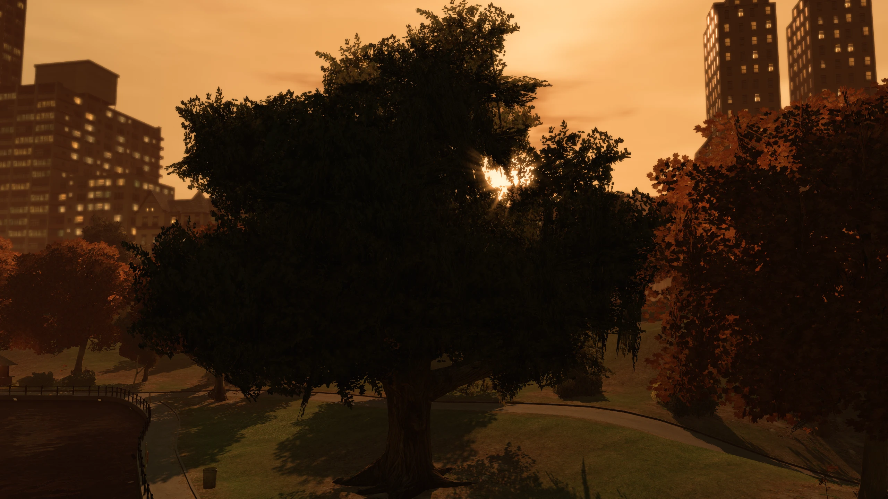
  
</div>

*Values:*

The minimum value for this option is 0.0 and the maximum is 1.0. A lower value means smaller rays, a higher value means longer rays.

- `SunShaftsDensity = 0.9` (Fusion Fix default)

### SunShaftsDecay

*Description:*

This setting changes how fast god rays fade out from the center. Just leave this as it is, changing it usually makes the sun shafts basically disappear.

*Values:*

The minimum value for this option is 0.0 and the maximum is 1.0.

- `SunShaftsDecay = 0.95` (Fusion Fix default)

## [POSTFX]

This section contains settings related to some of the games post-processing effects.

### EnablePreAlphaDepth

*Description:*

Certain post-processing effects didn't appear through transparent objects like they did on the console versions of the game, Fusion Fix fixes this. This setting allows you to enable and disable that fix.

*Comparisons:*

<div class="compare-container">
  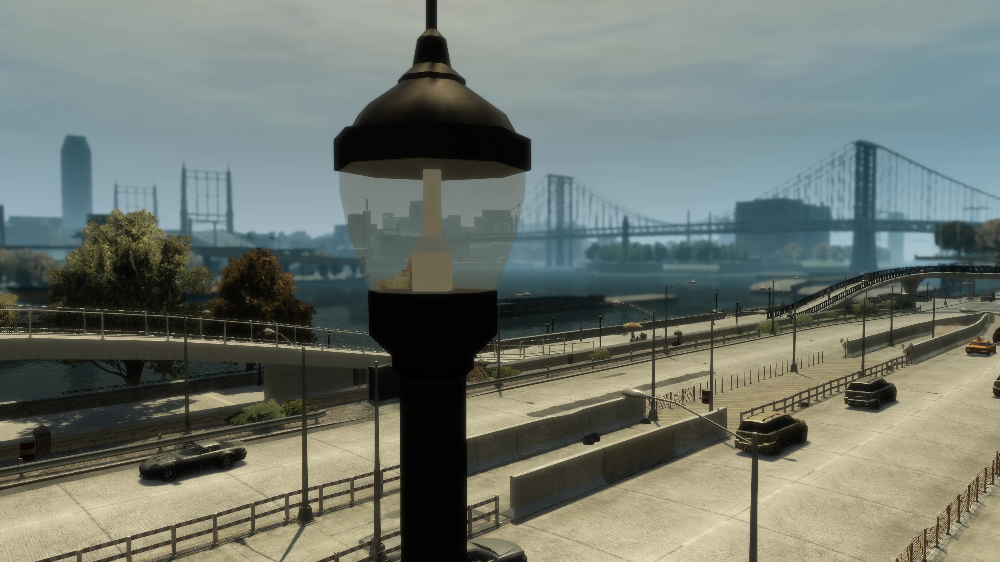
  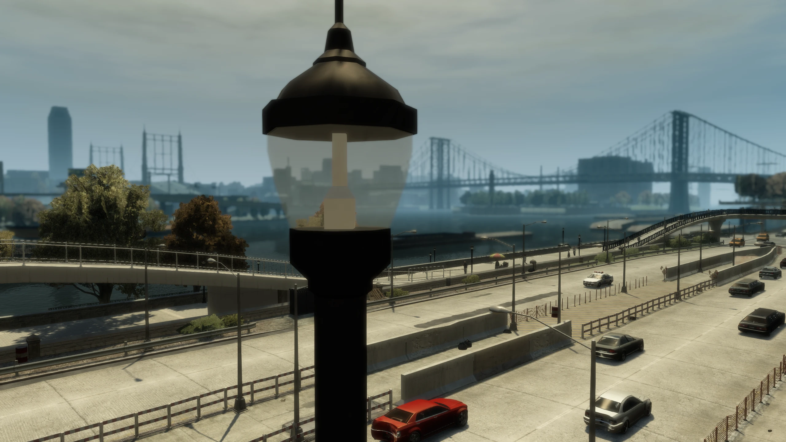
</div>

*Values:*

The minimum value for this setting is 0.0 and the maximum is 1.0. A lower value means a slower fade, a higher value means a faster fade.

- `EnablePreAlphaDepth = 1` - Enabled (Fusion Fix default)
- `EnablePreAlphaDepth = 0` - Disabled

### AmbientOcclusionBlurPasses

*Description:*

This setting is set to a specific value based on shader code and other setting values. Unless you know what you're doing, you shouldn't change this.

Values

- `AmbientOcclusionBlurPasses = 1` (Fusion Fix default)

### AmbientOcclusionSamples

*Description:*

This setting is set to a specific value based on shader code and other setting values. Unless you know what you're doing, you shouldn't change this.

*Values:*

- `AmbientOcclusionSamples = 9` (Fusion Fix default)

### AmbientOcclusionLogMaxOffset

*Description:*

This setting is set to a specific value based on shader code and other setting values. Unless you know what you're doing, you shouldn't change this.

*Values:*

The minimum value for this setting is 0.

- `AmbientOcclusionLogMaxOffset = 3` (Fusion Fix default)

### AmbientOcclusionMaxMipLevel

*Description:*

This setting is set to a specific value based on shader code and other setting values. Unless you know what you're doing, you shouldn't change this.

*Values:*

- `AmbientOcclusionMaxMipLevel = 5` (Fusion Fix default)

### AmbientOcclusionFarClip

*Description:*

This setting changes how far ambient occlusion is calculated and rendered.

*Comparisons:*

<div class="compare-container">
  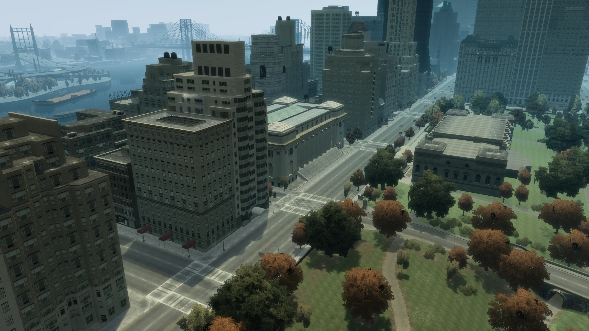
  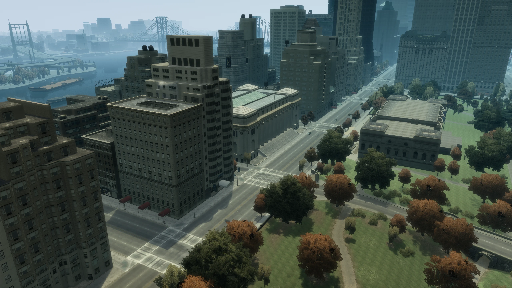
</div>

*Values:*

This setting uses a distance based value. 1 is meter, 1000 is 1000 meters.

- `AmbientOcclusionFarClip = 150` - 150 meters (Fusion Fix default)

### AmbientOcclusionRadius

*Description:*

This setting is set to a specific value based on shader code and other setting values. Unless you know what you're doing, you shouldn't change this.

*Values:*

- `AmbientOcclusionRadius = 1.125` (Fusion Fix default)

### AmbientOcclusionBias

*Description:*

This setting is set to a specific value based on shader code and other setting values. Unless you know what you're doing, you shouldn't change this.

*Values:*

- `AmbientOcclusionBias = 0.03` (Fusion Fix default)

### AmbientOcclusionIntensity

*Description:*

This setting changes how intense ambient occlusion is.

*Comparisons:*

<div class="compare-container">
  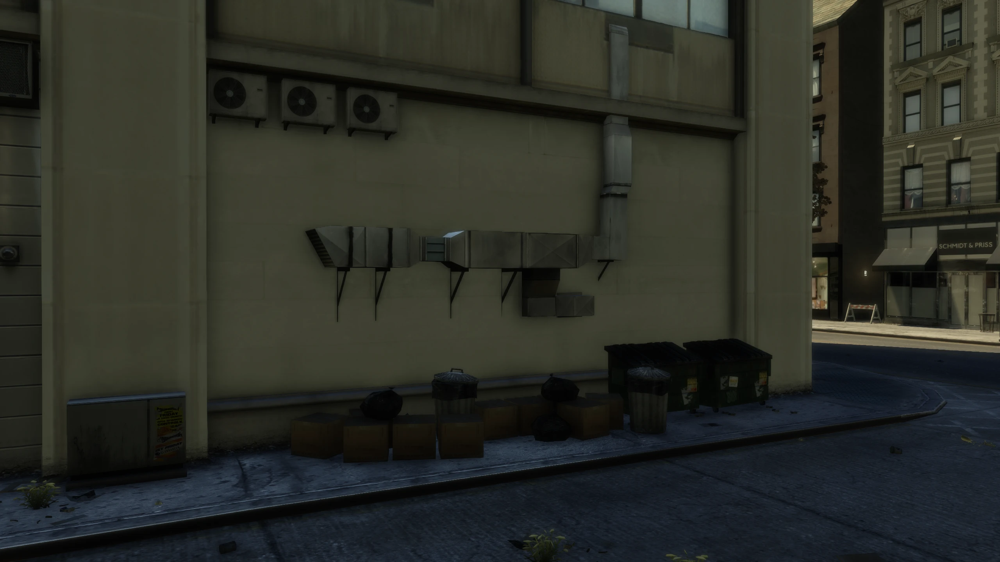
  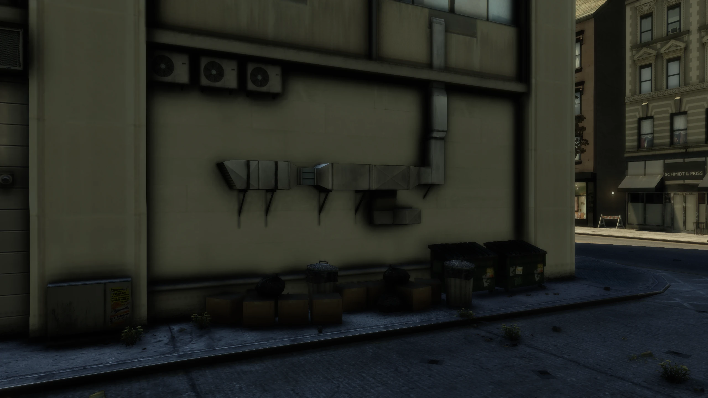
</div>

*Values:*

- `AmbientOcclusionIntensity = 0.4` (Fusion Fix default)

### AmbientOcclusionBlurRadius

*Description:*

This setting is set to a specific value based on shader code and other setting values. Unless you know what you're doing, you shouldn't change this.

*Values:*

- `AmbientOcclusionBlurRadius = 2.0` (Fusion Fix default)

## [SHADOWFILTERSHARP]

This section contains settings related to the "Sharp" [shadow filter option](../Fusion-Fix-Wiki/options.md/#shadow-filter-new){:target="_blank"}.

### ShadowSoftness

*Description:*

This setting changes the softness of the shadows seen when using the "Sharp" shadow filter.

*Comparisons:*

<div class="compare-container">
  
  
</div>

*Values:*

Lower values make shadows sharper, higher values make shadows softer.

- `ShadowSoftness = 1.5`  (Fusion Fix default)

### ShadowBias

*Description:*

This setting controls the bias used to prevent shadow artifacts.

*Values:*

If you increase [ShadowSoftness](#shadowsoftness) and notice artifacts, increase this until the artifacts stop. If you decrease [ShadowSoftness](#shadowsoftness) and notice artifacts, decrease this slightly until the artifacts stop.

- `ShadowBias = 5.0`  (Fusion Fix default)

## [SHADOWFILTERSOFT]

This section contains settings related to the "Soft" [shadow filter option](../Fusion-Fix-Wiki/options.md/#shadow-filter-new){:target="_blank"}.

### ShadowSoftness

*Description:*

This setting changes the softness of the shadows seen when using the "Soft" shadow filter.

*Comparisons:*

<div class="compare-container">
  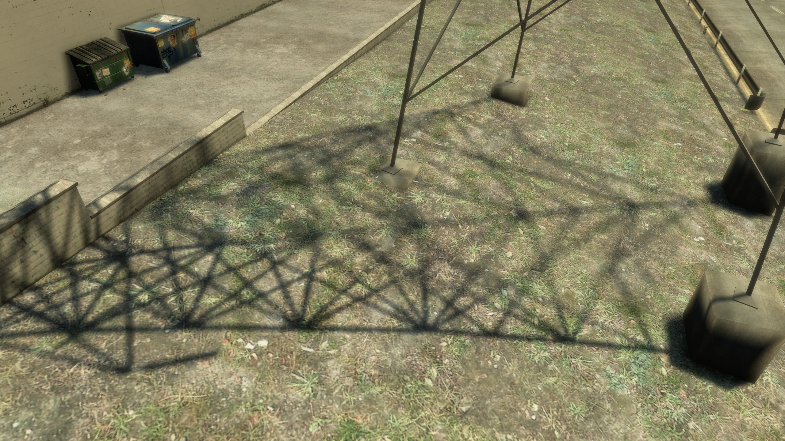
  
</div>

*Values:*

Lower values make shadows sharper, higher values make shadows softer.

- `ShadowSoftness = 3.0`  (Fusion Fix default)

### ShadowBias

*Description:*

This setting controls the bias used to prevent shadow artifacts.

*Values:*

If you increase [ShadowSoftness](#shadowsoftness_1) and notice artifacts, increase this until the artifacts stop. If you decrease [ShadowSoftness](#shadowsoftness_1) and notice artifacts, decrease this slightly until the artifacts stop.

- `ShadowBias = 8.0`  (Fusion Fix default)

## [SHADOWFILTERCHSS]

This section contains settings related to the "CHSS" [shadow filter option](../Fusion-Fix-Wiki/options.md/#shadow-filter-new){:target="_blank"}.

CHSS shadows are different from other shadow filters. These shadows are sharper near the object that are casting them and softer further from the object casting them, making them more realistic.

### ShadowSoftness

*Description:*

This setting changes the minimum softness of the shadows seen when using the "CHSS" shadow filter.

*Comparisons:*

<div class="compare-container">
  
  
</div>

*Values:*

Lower values make shadows sharper, higher values make shadows softer.

- `ShadowSoftness = 3.0`  (Fusion Fix default)

### ShadowBias

*Description:*

This setting controls the bias used to prevent shadow artifacts.

*Values:*

If you increase [ShadowSoftness](#shadowsoftness_2) or [MaxSoftness](#maxsoftness) and notice artifacts, increase this until the artifacts stop. If you decrease [ShadowSoftness](#shadowsoftness) or [MaxSoftness](#maxsoftness) and notice artifacts, decrease this slightly until the artifacts stop.

- `ShadowBias = 5.0`  (Fusion Fix default)

### MaxSoftness

*Description:*

This setting changes the maximum softness of the shadows seen when using the "CHSS" shadow filter.

*Comparisons:*

<div class="compare-container">
  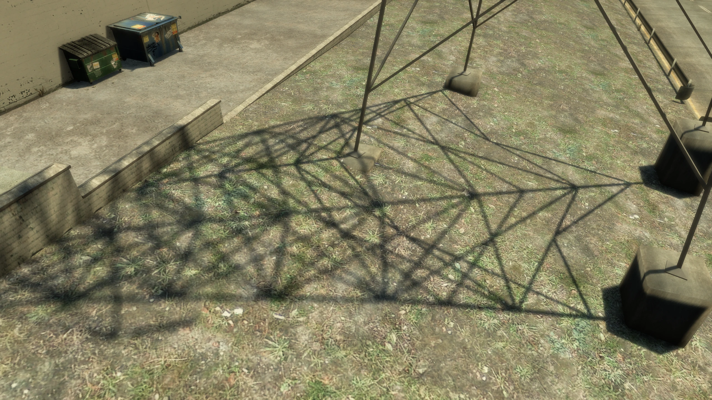
  
</div>

*Values:*

Lower values make shadows sharper, higher values make shadows softer.

- `MaxSoftness = 20.0`  (Fusion Fix default)

## [PROJECT2DFX]

Project 2DFX is directly integrated into Fusion Fix. It is enabled when you change the [Distant Lights option](../Fusion-Fix-Wiki/options.md/#distant-lights-new){:target="_blank"} to "Project 2DFX.

These settings are in the original Project 2DFX mod, but they're still available in the Fusion Fix config file in case you want to use them.

### CoronaRadiusMultiplier

*Description:*

This setting changes the size of the distant coronas (lights).

*Comparisons:*

<div class="compare-container">
  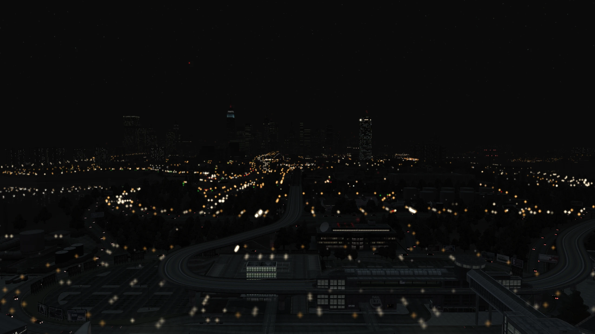
  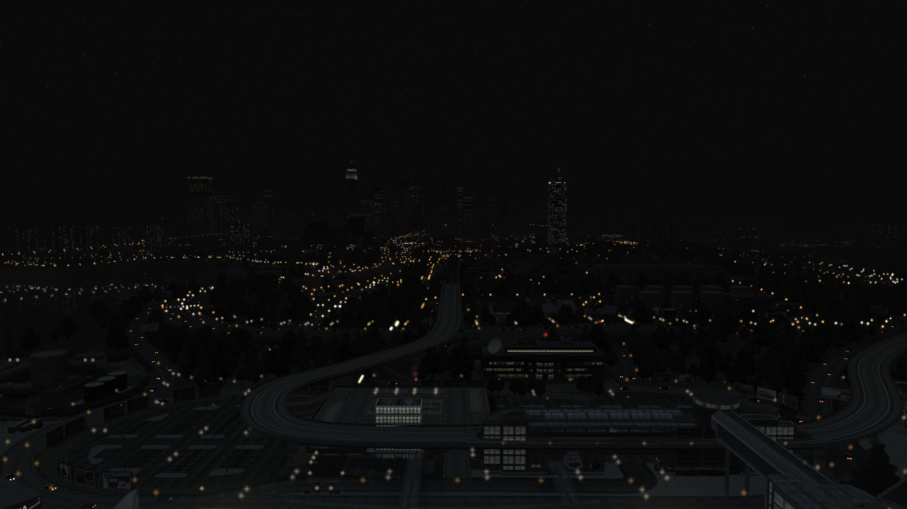
</div>

*Values:*

This setting is a multiplier, so going from 1.0 to 2.0 can be quite significant. Lower values make coronas smaller, higher values make coronas smaller.

- `CoronaRadiusMultiplier = 1.0`  (Fusion Fix default)

### CoronaAlphaMultiplier

*Description:*

This setting changes the intensity of the distant coronas (lights).

*Comparisons:*

<div class="compare-container">
  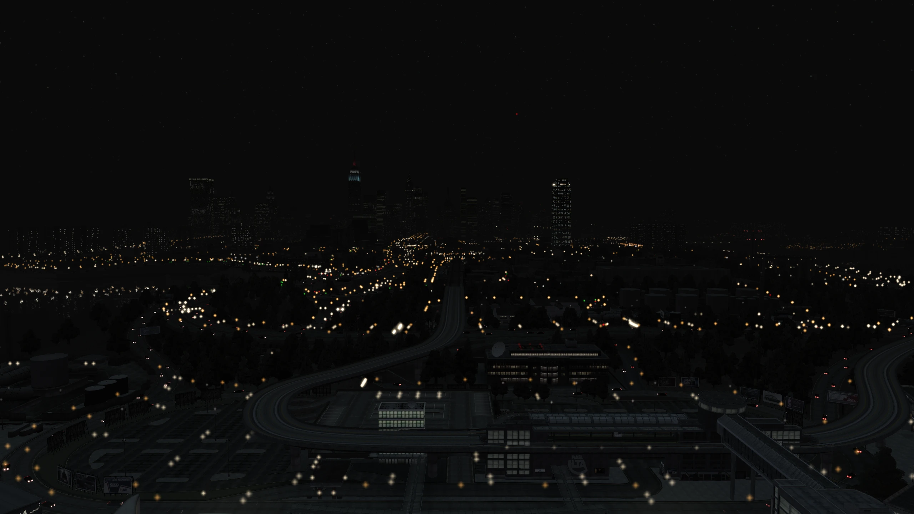
  
</div>

*Values:*

This setting is a multiplier, so going from 1.0 to 2.0 can be quite significant. Lower values make coronas less intense, higher values make coronas more intense.

- `CoronaAlphaMultiplier = 1.0`  (Fusion Fix default)

### SlightlyIncreaseRadiusWithDistance

*Description:*

This setting causes distant coronas (lights) to become slightly bigger the further away they are.

*Comparisons:*

<div class="compare-container">
  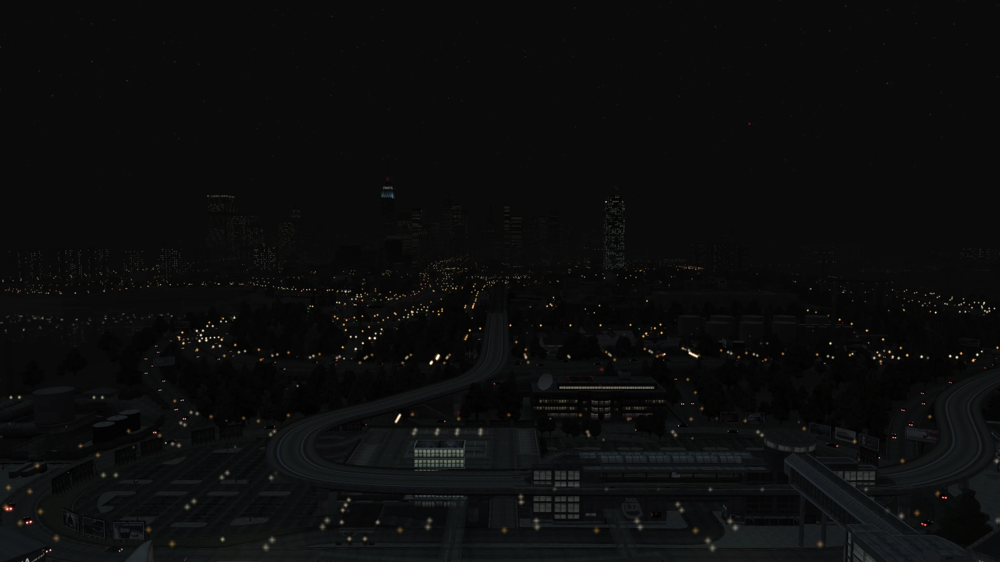
  
</div>

*Values:*

- `SlightlyIncreaseRadiusWithDistance = 1` - Enabled  (Fusion Fix default)
- `SlightlyIncreaseRadiusWithDistance = 0` - Disabled

### DisableDefaultLodLights

*Description:*

This setting allows you to enable or disable the original games distant coronas (lights) while using the Project 2DFX ones. The original games distant coronas weren't very accurate.

*Comparisons:*

<div class="compare-container">
  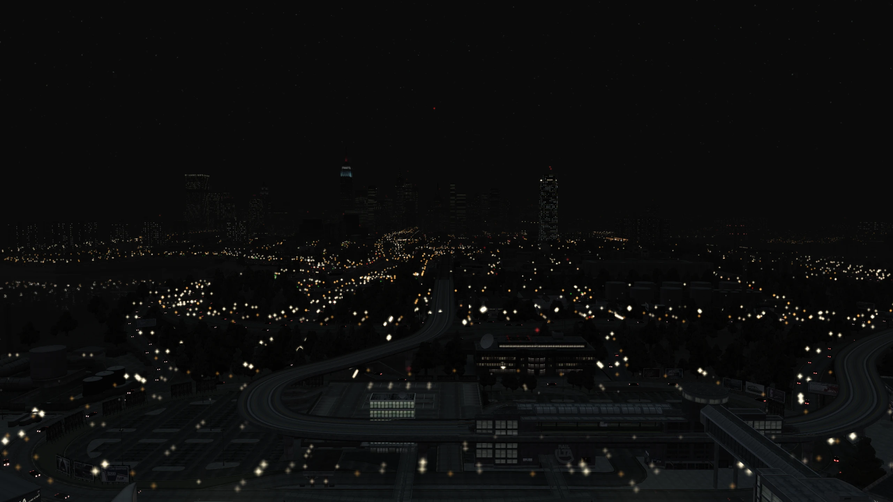
  
</div>

*Values:*

- `DisableDefaultLodLights = 1` - Enabled  (Fusion Fix default)
- `DisableDefaultLodLights = 0` - Disabled

## [TURNINDICATORS]

This section contains settings related to the [Turn Indicators option](../Fusion-Fix-Wiki/options.md/#turn-indicators-new){:target="_blank"}.

### ManualTurnIndicators

*Description:*

This setting allows you to manually control turn indicators when the [Turn Indicators option](../Fusion-Fix-Wiki/options.md/#turn-indicators-new){:target="_blank"} is enabled.

*Values:*

- `ManualTurnIndicators = 1` - Enabled
- `ManualTurnIndicators = 0` - Disabled (Fusion Fix default)

### LeftIndicatorKey

*Description:*

This setting allows you to change the key used for the left indicator in vehicles when [ManualTurnIndicators](#manualturnindicators) is enabled.

*Values:*

This setting uses virtual key codes. You can find a list of them [here](https://learn.microsoft.com/en-us/windows/win32/inputdev/virtual-key-codes){target="_blank" rel="noopener noreferrer"}, copy the value of the key you want and use it for this setting.

- `LeftIndicatorKey = 0xDB` - Left brace key `[` turns on the left indicator (Fusion Fix default)
- `LeftIndicatorKey = 0x51` - `Q` turns on the left indicator

### RightIndicatorKey

*Description:*

This setting allows you to change the key used for the right indicator in vehicles when [ManualTurnIndicators](#manualturnindicators) is enabled.

*Values:*

This setting uses virtual key codes. You can find a list of them [here](https://learn.microsoft.com/en-us/windows/win32/inputdev/virtual-key-codes){target="_blank" rel="noopener noreferrer"}, copy the value of the key you want and use it for this setting.

- `RightIndicatorKey = 0xDD` - Right brace key `]` turns on the right indicator (Fusion Fix default)
- `RightIndicatorKey = 0x45` - `E` turns on the right indicator

## [EXPERIMENTAL]

This section contains experimental settings.

### DisplayMemoryStats

This setting enables additional memory information such as overall memory currently being used by the game and overall streaming memory usage used by the game.

You must have the [FPS Counter](../Fusion-Fix-Wiki/options.md/#fps-counter-new) option enabled to view this.

*Comparisons*

TODO

*Values*

- `DisplayMemoryStats = 0` - Disabled (Fusion Fix default)
- `DisplayMemoryStats = 1` - Enabled

### ReflectionMSAAQuality

*Description:*

This setting enables MSAA on reflections seen on things like cars, water and mirrors. 

*Comparisons:*

<div class="compare-container">
  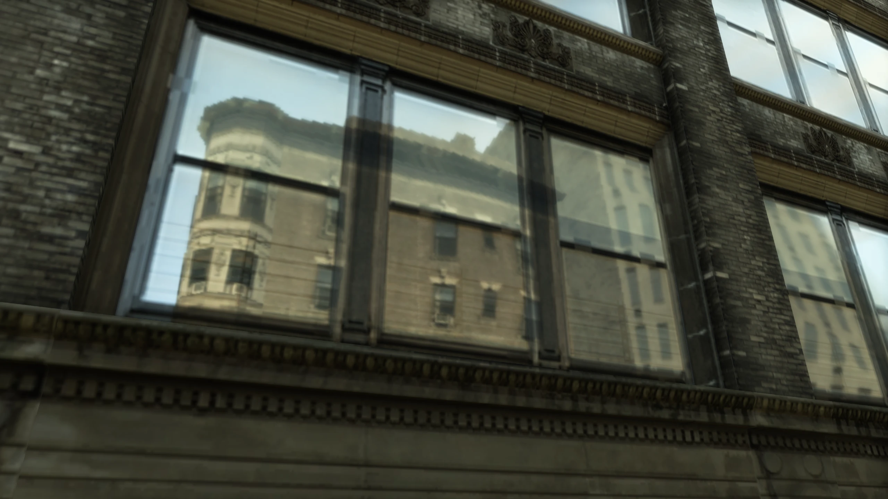
  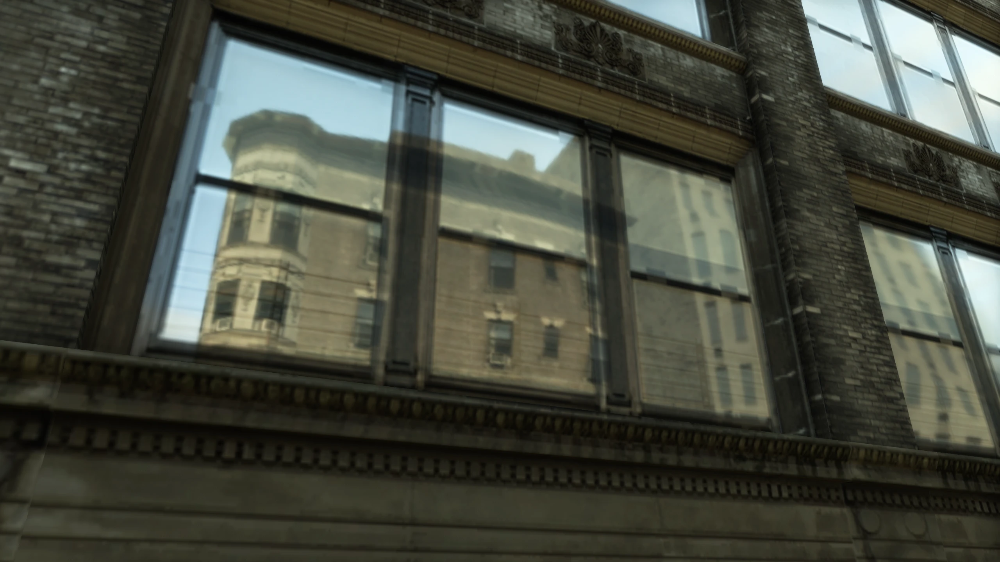
</div>

<div class="compare-container">
  
  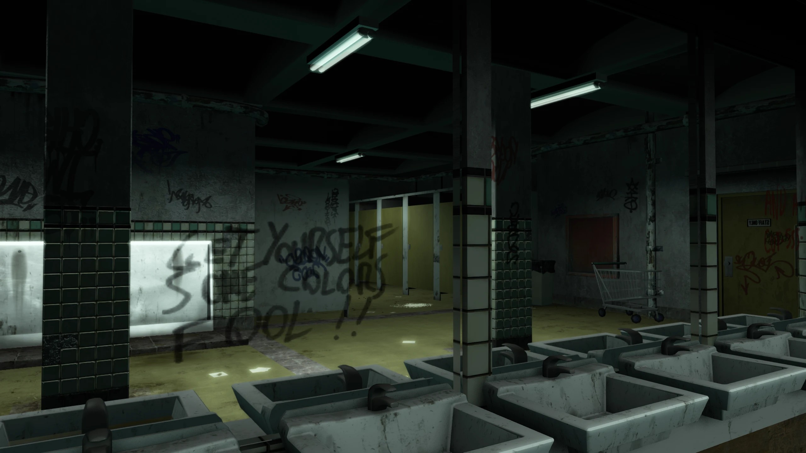
</div>

*Values:*

Any values other than 2, 4 and 8 will disable this setting. Higher values impact performance.

- `ReflectionMSAAQuality = 0` - No MSAA  (Fusion Fix default)
- `ReflectionMSAAQuality = 2` - 2x MSAA
- `ReflectionMSAAQuality = 4` - 4x MSAA
- `ReflectionMSAAQuality = 8` - 8x MSAA